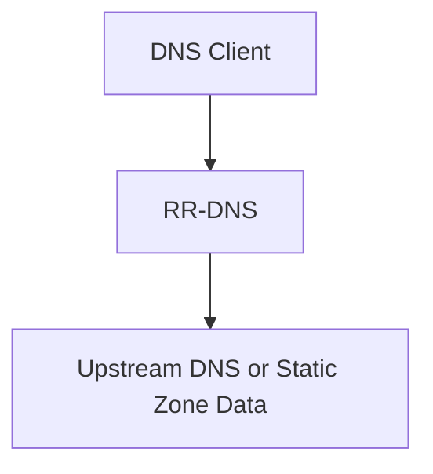
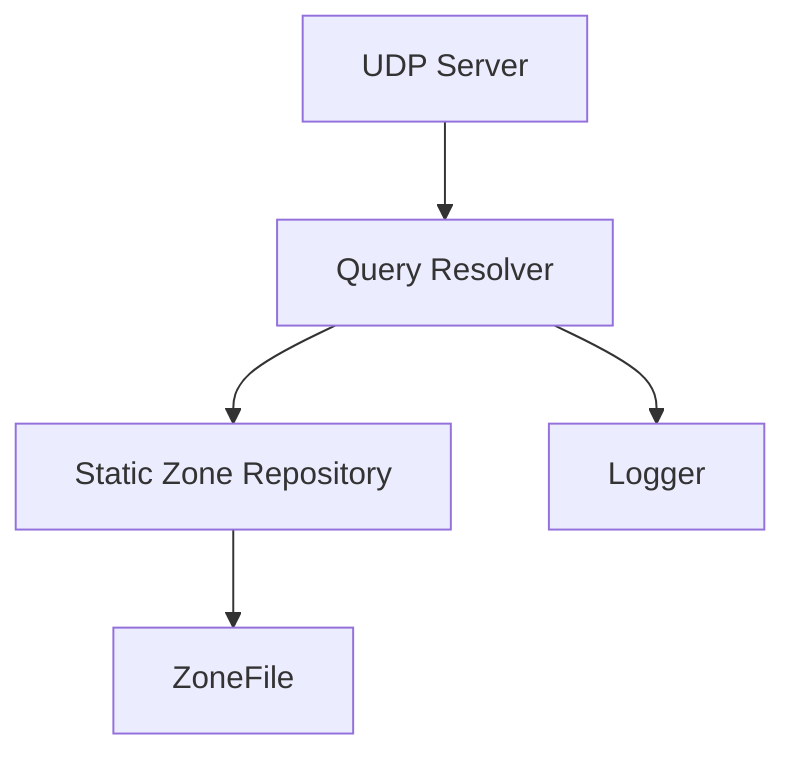
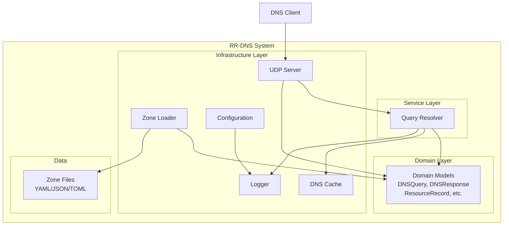
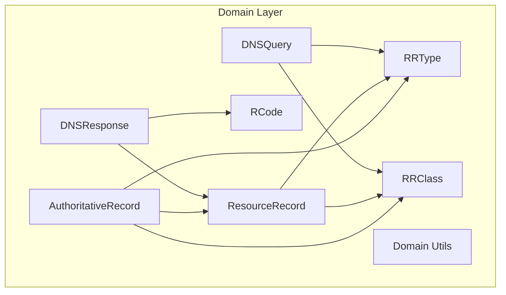
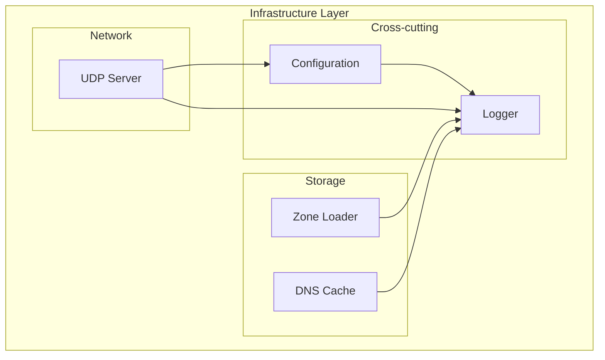
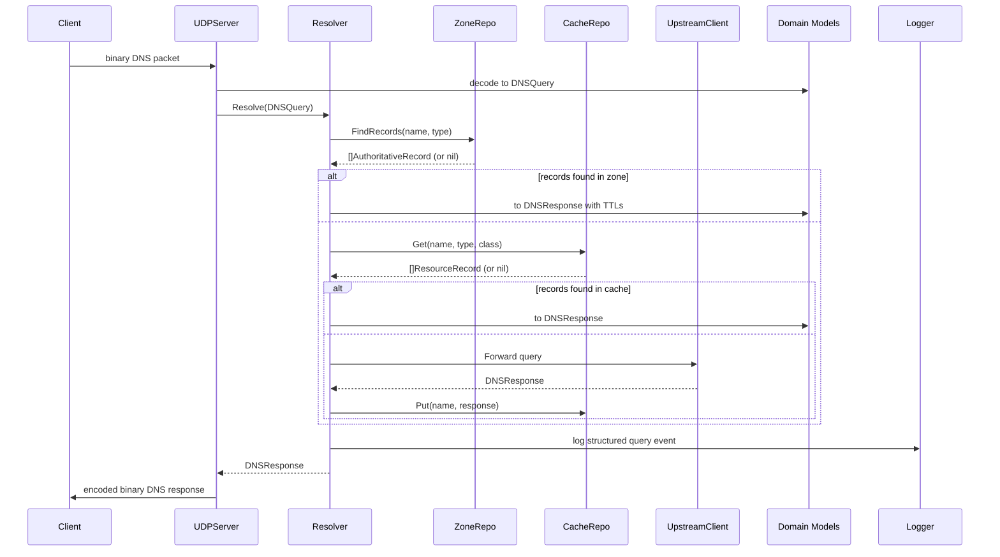
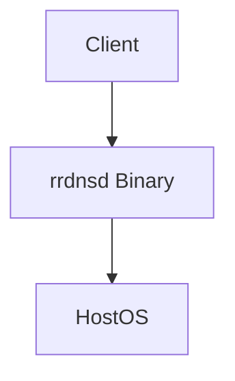

# RR-DNS

A lightweight, modern, CLEAN, and extensible golang DNS server.

# 1. Introduction and Goals

RR-DNS is a lightweight, high-performance DNS server written in Go. It aims to provide a clean, testable implementation of a DNS resolver following the principles of CLEAN architecture and SOLID design. The project is suitable for local networks, containerized environments, embedded devices, and privacy-aware users seeking ad-blocking and custom resolution behavior.

## Requirements Overview

- Accept DNS queries over UDP (IPv4 and IPv6).
- Respond to A and AAAA queries with static zone data.
- Deliver minimal memory footprint and fast startup time.
- Log queries in structured format.
- Support extensibility (e.g., blocklists, web admin interface).

## Quality Goals

| Goal               | Motivation                                         |
|--------------------|----------------------------------------------------|
| Performance        | Fast response to DNS queries with minimal overhead |
| Simplicity         | Easy to configure and deploy                       |
| Testability        | Isolated unit testing of core services             |
| Maintainability    | Clean boundaries and clear responsibility per layer|
| Security           | Input validation and safe parsing of DNS payloads |

## Stakeholders

| Role/Name       | Contact                    | Expectations                                      |
|------------------|-----------------------------|---------------------------------------------------|
| Maintainer       | @haukened                  | Maintain a robust, well-architected DNS server    |
| Developers       | Contributors               | Easily contribute to a modular and testable codebase |
| Home users       | n/a                        | Simple DNS setup, privacy features, ad blocking   |
| DevOps Engineers | n/a                        | Lightweight resolver for container-based platforms |

# 2. Architecture Constraints

- Must be written in Go.
- Must build into a single statically-linked binary.
- Follow CLEAN architecture boundaries.
- Must not pull in large runtime dependencies or DNS libraries.
- Logging must be structured and human-readable (`logger.Info({...}, "msg")`).

# 3. Context and Scope

## 3.1 Business Context



RR-DNS acts as a local DNS resolver for internal clients. It either serves DNS records from a local in-memory zone or passes through to upstream resolvers (future phase). It may also serve as a DNS sinkhole for ad/tracker blocking.

## 3.2 Technical Context



- UDP server receives and parses requests.
- Query is forwarded to a Resolver service.
- Resolver queries zone records from a repository.
- Result is formatted into a DNS response and returned.

# 4. Solution Strategy

- Use CLEAN architecture to separate domain logic, services, and infrastructure.
- All DNS logic is implemented in-house; no reliance on external parsing libraries.
- Minimal binary using Go's standard tooling.
- Use Go interfaces and DI for mockability and testability.

# 5. Building Block View

This section shows the static decomposition of RR-DNS into building blocks and their dependencies. The view follows a hierarchical structure showing the system at different levels of detail.

## 5.1 Whitebox Overall System

***Overview Diagram***



***Motivation***

RR-DNS follows CLEAN architecture principles with clear separation between domain logic, application services, and infrastructure concerns. This ensures testability, maintainability, and allows for easy extension with additional features.

***Contained Building Blocks***

| **Building Block** | **Responsibility** |
|--------------------|--------------------|
| Domain Models | Pure domain entities representing DNS concepts (queries, responses, records) |
| Query Resolver | Core business logic for DNS query resolution |
| UDP Server | Network protocol handling and packet parsing |
| Zone Loader | Loading and parsing zone files from disk |
| DNS Cache | In-memory LRU cache for performance optimization |
| Logger | Structured logging across all components |
| Configuration | Environment-based configuration management |

***Important Interfaces***

- `QueryResolver` interface: Main service contract for DNS resolution
- `ZoneRepository` interface: Abstraction for zone data access
- `CacheRepository` interface: Abstraction for cached record storage

## 5.2 Level 2

### 5.2.1 White Box: Domain Layer

***Overview Diagram***



***Motivation***

The domain layer contains pure business entities free from infrastructure concerns. These types serve as contracts between layers and ensure type safety across the system.

***Contained Building Blocks***

| **Name** | **Responsibility** |
|----------|-------------------|
| DNSQuery | Represents incoming DNS questions from clients |
| DNSResponse | Complete DNS response with answers, authority, and additional sections |
| ResourceRecord | Cached DNS records with expiration timestamps |
| AuthoritativeRecord | Zone file records with TTL for authoritative responses |
| RRType | DNS record types (A, AAAA, MX, etc.) |
| RRClass | DNS classes (typically IN) |
| RCode | DNS response codes (NOERROR, NXDOMAIN, etc.) |

> For detailed domain model documentation, see [`internal/dns/domain/00_domain.md`](../../internal/dns/domain/00_domain.md)

### 5.2.2 White Box: Infrastructure Layer

***Overview Diagram***



***Motivation***

Infrastructure components handle external concerns like networking, file I/O, caching, and logging. They are designed to be replaceable and testable through interfaces.

***Contained Building Blocks***

| **Name** | **Responsibility** |
|----------|-------------------|
| UDP Server | Listen for DNS packets, parse protocol, delegate to resolver |
| Zone Loader | Load and parse zone files (YAML/JSON/TOML) into domain objects |
| DNS Cache | LRU cache for DNS records to improve query performance |
| Logger | Structured logging with configurable levels and output formats |
| Configuration | Load and validate configuration from environment variables |

## 5.3 Level 3

### 5.3.1 Black Box: Zone Loader

***Purpose/Responsibility***
- Load DNS zone files from a configured directory
- Support multiple formats: YAML, JSON, TOML
- Parse zone data into `AuthoritativeRecord` domain objects
- Handle file format validation and error reporting

***Interface***
```go
func LoadZoneDirectory(dir string, defaultTTL time.Duration) ([]*domain.AuthoritativeRecord, error)
```

***Quality/Performance Characteristics***
- Loads all zone files at startup (not runtime)
- Fails fast on invalid zone files
- Memory efficient parsing using streaming where possible

***Directory/File Location***
`internal/dns/infra/zone/zone.go`

***Zone File Format***
- Each file must contain a `zone_root` field
- Labels are expanded to FQDNs using the zone root
- Supported formats: `.yaml`, `.yml`, `.json`, `.toml`

**Example YAML:**
```yaml
zone_root: example.com
www:
  A: 
    - "1.2.3.4"
    - "5.6.7.8"
mail:
  MX: "mail.example.com"
```

### 5.3.2 Black Box: DNS Cache

***Purpose/Responsibility***
- Provide fast, in-memory LRU cache for DNS resource records
- Reduce lookup latency and zone file access
- Thread-safe operations for concurrent queries
- Automatic expiration based on TTL

***Interface***
```go
type Cache interface {
    Get(key string) ([]domain.ResourceRecord, bool)
    Put(key string, records []domain.ResourceRecord, ttl time.Duration)
    Delete(key string)
    Clear()
    Size() int
}
```

***Quality/Performance Characteristics***
- LRU eviction policy
- Configurable cache size
- Thread-safe for concurrent access
- O(1) average case performance

***Directory/File Location***
`internal/dns/infra/dnscache/dnscache.go`

***Uses***
- [`github.com/hashicorp/golang-lru/v2`](https://github.com/hashicorp/golang-lru) for LRU implementation

### 5.3.3 Black Box: Configuration

***Purpose/Responsibility***
- Load configuration from environment variables
- Validate configuration values using struct tags
- Provide defaults for optional settings
- Support multiple data types (strings, integers, arrays)

***Interface***
```go
type AppConfig struct {
    CacheSize uint     `koanf:"cache_size" validate:"required,gte=1"`
    Env       string   `koanf:"env" validate:"required,oneof=dev prod"`
    LogLevel  string   `koanf:"log_level" validate:"required,oneof=debug info warn error"`
    Port      int      `koanf:"port" validate:"required,gte=1,lt=65535"`
    ZoneDir   string   `koanf:"zone_dir" validate:"required"`
    Upstream  []string `koanf:"upstream" validate:"required,dive,hostname_port"`
}

func Load() (*AppConfig, error)
```

***Quality/Performance Characteristics***
- Validation on load with clear error messages
- Environment variable prefix: `UDNS_`
- Case-insensitive key transformation

***Directory/File Location***
`internal/dns/infra/config/config.go`

***Configuration Options***
- `UDNS_CACHE_SIZE`: DNS cache size (default: 1000)
- `UDNS_ENV`: Runtime environment "dev" or "prod" (default: "prod")
- `UDNS_LOG_LEVEL`: Log level (default: "info")
- `UDNS_PORT`: DNS server port (default: 53)
- `UDNS_ZONE_DIR`: Zone files directory (default: "/etc/rr-dns/zones/")
- `UDNS_UPSTREAM`: Upstream DNS servers (default: "1.1.1.1:53,1.0.0.1:53")

### 5.3.4 Black Box: Logger

***Purpose/Responsibility***
- Provide structured logging across all components
- Support multiple log levels and output formats
- Configure logging based on environment (dev/prod)
- Thread-safe logging operations

***Interface***
```go
func Configure(env, logLevel string)
func Info(fields map[string]any, msg string)
func Error(fields map[string]any, msg string)
func Debug(fields map[string]any, msg string)
func Warn(fields map[string]any, msg string)
func Panic(fields map[string]any, msg string)
func Fatal(fields map[string]any, msg string)
```

***Quality/Performance Characteristics***
- Structured JSON logging in production
- Human-readable console logging in development
- High performance with minimal allocations
- Non-blocking log operations

***Directory/File Location***
`internal/dns/infra/log/log.go`

***Uses***
- [`go.uber.org/zap`](https://github.com/uber-go/zap) for high-performance logging

# 6. Runtime View

## 6.1 Incoming A/AAAA query

- UDPServer receives binary query.
- Parsed into a DNSQuery domain object.
- Resolver looks up name/type in ZoneRepository.
- DNSResponse is created and encoded.
- UDPServer sends response back to client.



# 7. Deployment View

## 7.1 Infrastructure Level 1



Motivation  
RR-DNS should be easy to run on Linux, inside Docker, or on embedded systems. No root requirements beyond port binding.

Quality and/or Performance Features  
- Fast startup
- Low memory
- Concurrent query handling via goroutines

Mapping of Building Blocks to Infrastructure  
- All services are compiled into `rrdnsd` binary.

# 8. Cross-cutting Concepts

## 8.1 Logging

- Use structured logging via `logger.Info(map[string]any{ "field": value }, "message")`

## 8.2 Configuration

- Config loaded from env or CLI flags (e.g. `--zone-file`)

## 8.3 Testability

- Domain and service layers are fully unit tested.
- Mock ZoneRepository in resolver tests.

# 9. Architecture Decisions

- Chose Go for speed, simplicity, concurrency, and static binary builds.
- Implemented custom DNS parsing to maintain full control.
- Adopted CLEAN architecture for long-term maintainability and clarity.

# 10. Quality Requirements

## 10.1 Quality Tree

(tbd — can be added later as a Mermaid tree)

## 10.2 Quality Scenarios

- RR-DNS should respond to 1000 QPS without dropping queries.
- RR-DNS should start in < 50ms.
- Zone records should be reloadable without restart (future).

# 11. Risks and Technical Debts

- Current version does not validate malformed DNS messages.
- Does not support TCP fallback.
- In-memory zone is not reloadable yet.
- No privacy features yet for upstream resolvers, like DoH or DNS over TLS.

# 12. Glossary

| Term             | Definition                                          |
|------------------|-----------------------------------------------------|
| Zone             | A mapping of DNS names to resource records          |
| Resource Record  | A typed DNS record (A, AAAA, CNAME, etc.)           |
| Resolver         | A component that answers DNS queries                |
| Query ID         | Unique identifier for matching request/response     |


# Acknowledgments

This documentation structure is based on the [arc42](https://arc42.org) architecture template by Dr. Peter Hruschka, Dr. Gernot Starke, and contributors.  
Arc42 is licensed under the [Creative Commons Attribution-ShareAlike 4.0 International License](https://creativecommons.org/licenses/by-sa/4.0/).