# RR-DNS

A lightweight, modern, CLEAN, and extensible golang DNS server.

# 1. Introduction and Goals

RR-DNS is a lightweight, high-performance DNS server written in Go. It aims to provide a clean, testable implementation of a DNS resolver following the principles of CLEAN architecture and SOLID design. The project is suitable for local networks, containerized environments, and privacy-aware users seeking ad-blocking and custom resolution behavior.

## Requirements Overview

- Accept DNS queries over UDP (IPv4 and IPv6).
- Respond to A and AAAA queries with static zone data.
- Deliver minimal memory footprint and fast startup time.
- Log queries in structured format.
- Support extensibility (e.g., blocklists, web admin interface).

## Quality Goals

| Goal               | Motivation                                         |
|--------------------|----------------------------------------------------|
| Performance        | Fast response to DNS queries with minimal overhead |
| Simplicity         | Easy to configure and deploy                       |
| Testability        | Isolated unit testing of core services             |
| Maintainability    | Clean boundaries and clear responsibility per layer|
| Security           | Input validation and safe parsing of DNS payloads |

## Stakeholders

| Role/Name       | Contact                    | Expectations                                      |
|------------------|-----------------------------|---------------------------------------------------|
| Maintainer       | @haukened                  | Maintain a robust, well-architected DNS server    |
| Developers       | Contributors               | Easily contribute to a modular and testable codebase |
| Home users       | n/a                        | Simple DNS setup, privacy features, ad blocking   |
| DevOps Engineers | n/a                        | Lightweight resolver for container-based platforms |

# 2. Architecture Constraints

- Must be written in Go.
- Must build into a single statically-linked binary.
- Follow CLEAN architecture boundaries.
- Must not pull in large runtime dependencies or DNS libraries.
- Logging must be structured and human-readable (`logger.Info({...}, "msg")`).

# 3. Context and Scope

## 3.1 Business Context


RR-DNS acts as a local DNS resolver for internal clients. It either serves DNS records from a local in-memory zone or forwards queries to upstream DNS servers. It may also serve as a DNS sinkhole for ad/tracker blocking.

## 3.2 Technical Context


- UDP server receives and parses requests.
- Query is forwarded to a Resolver service.
- Resolver first checks local zone records from repository.
- If not found locally, resolver checks DNS block list for blocked domains.
- If not blocked and not in zones, resolver checks DNS cache.
- If cache miss, resolver forwards query to upstream DNS servers via upstream resolver.
- Resolver receives upstream response and caches it before returning to client.
- All query processing steps are logged for monitoring and debugging.
- Response is returned to client with optimal latency.

Since mermaid diagrams don't guarantee ordering, to eliminate ambiguity, the query resolver orders steps:


# 4. Solution Strategy

- Use CLEAN architecture to separate domain logic, services, and infrastructure.
- All DNS logic is implemented in-house; no reliance on external parsing libraries.
- Minimal binary using Go's standard tooling.
- Use Go interfaces and DI for mockability and testability.

# 5. Building Block View

This section shows the static decomposition of RR-DNS into building blocks and their dependencies. The view follows a hierarchical structure showing the system at different levels of detail.

## 5.1 Whitebox Overall System

***Overview Diagram***


***Motivation***

RR-DNS follows CLEAN architecture principles with clear separation between domain logic, application services, and infrastructure concerns. This ensures testability, maintainability, and allows for easy extension with additional features.

***Contained Building Blocks***

| **Building Block** | **Responsibility** |
|--------------------|--------------------|
| DNS Query Resolver | Core business logic for DNS query resolution, orchestrates all resolution strategies |
| Domain Models | Pure domain entities representing DNS concepts (queries, responses, records) |
| Transport Layer | Network protocol handling and packet parsing (UDP, DoH, DoT, DoQ) |
| Zone Repository | Loading and parsing zone files from disk with value-based record creation |
| Zone Cache | Ultra-fast in-memory storage for authoritative DNS records with value-based architecture |
| DNS Cache | In-memory LRU cache for performance optimization with TTL-aware expiration |
| Upstream Resolver | Forward queries to external DNS servers when no local data available |
| DNS Block List | Block malicious/unwanted domains using configurable blocklist sources |
| Structured Logger | High-performance structured logging across all components |
| Clock Abstraction | Time abstraction for deterministic testing of time-dependent operations |
| DNS Utils | DNS name processing, normalization, and apex domain extraction |
| Configuration | Environment-based configuration management with comprehensive validation |

***Important Interfaces***

> 📖 **Detailed Documentation**: [DNS Resolver Service README](../internal/dns/services/resolver/README.md)

- `DNSResponder` interface: Main service contract for DNS query processing
- `ZoneCache` interface: Ultra-fast authoritative record storage with value-based operations  
- `Cache` interface: TTL-aware upstream response caching with bulk record support
- `UpstreamClient` interface: External DNS server communication abstraction
- `ServerTransport` interface: Network protocol abstraction supporting multiple transport types
- `Blocklist` interface: Domain filtering and security feature framework

## 5.2 Level 2

### 5.2.1 White Box: Domain Layer

> 📖 **Detailed Documentation**: [Domain README](../internal/dns/domain/README.md)

***Overview Diagram***


***Motivation***

The domain layer contains pure business entities free from infrastructure concerns. These types serve as contracts between layers and ensure type safety across the system. The unified ResourceRecord design provides better performance through value-based storage and CPU cache locality.

***Contained Building Blocks***

| **Name** | **Responsibility** |
|----------|-------------------|
| Question | Represents incoming DNS questions from clients |
| DNSResponse | Complete DNS response with answers, authority, and additional sections |
| ResourceRecord | Unified DNS record type with dual constructors for cached and authoritative records |
| RRType | DNS record types (A, AAAA, MX, etc.) |
| RRClass | DNS classes (typically IN) |
| RCode | DNS response codes (NOERROR, NXDOMAIN, etc.) |

***Key Design Changes***

- **Unified ResourceRecord**: Single type replaces separate cached/authoritative records
- **Value-Based Storage**: Records stored as values (not pointers) for better performance
- **Dual Constructors**: `NewCachedResourceRecord()` and `NewAuthoritativeResourceRecord()` (now with `text string` argument) provide creation patterns for expiring vs. authoritative records
- **Dual RDATA Representation**: Each record may carry both `Data` (wire bytes) and `Text` (human-readable). At least one must be set; both are typically populated to avoid repeated decode work and to preserve original zone content.

### 5.2.2 White Box: Infrastructure Layer

> 📖 **Detailed Documentation**: 
> - [Common Services](../internal/dns/common/README.md)
> - [Configuration](../internal/dns/config/README.md)  
> - [Gateways](../internal/dns/gateways/README.md)
> - [Repositories](../internal/dns/repos/README.md)

***Overview Diagram***

> Note: The infrastructure layer is organized into focused directories. Components within each directory work together but maintain loose coupling across directories.

```mermaid
graph TD
    subgraph "Infrastructure Layer"
        subgraph "Common Services"
            direction TB
            Logger[Structured Logger]
            Clock[Clock Abstraction]
            Utils[DNS Utils]
        end
        
        subgraph "Configuration"
            direction TB
            Config[Environment Config]
        end
        
        subgraph "Gateways"
            direction TB
            Transport[Transport Layer<br/>UDP/DoH/DoT/DoQ]
            Upstream[Upstream Resolver]  
            Wire[Wire Format Codec]
        end
        
        subgraph "Repositories"
            direction TB
            ZoneLoader[Zone Repository] --> ZoneFiles[Zone Files<br/>YAML/JSON/TOML]
            ZoneCache[Zone Cache] --> ValueMem[Value-Based Storage]
            DNSCache[DNS Cache] --> ValueLRU[Value-Based LRU]
            BlockList[Blocklist Repository] --> BlockDB[Block Sources]
        end
    end
```go
// Helper wrappers demonstrating current constructor signatures including text parameter
func NewCachedRecord(name string, rrType RRType, ttl uint32, data []byte, text string, now time.Time) ResourceRecord {
    // text: human-readable RDATA (e.g. "192.0.2.1", "10 mail.example.com.")
    return NewCachedResourceRecord(name, rrType, RRClass(1), ttl, data, text, now)
}

func NewAuthoritativeRecord(name string, rrType RRType, ttl uint32, data []byte, text string) ResourceRecord {
    return NewAuthoritativeResourceRecord(name, rrType, RRClass(1), ttl, data, text)
}
| **Directory** | **Components** | **Responsibility** |
|---------------|----------------|-------------------|
| **Common** | Logger, Clock, Utils | Structured logging, time abstraction for testing, DNS name utilities |
| **Config** | Configuration | Load and validate configuration from environment variables |
| **Gateways** | Transport, Upstream, Wire | Network protocols, external DNS servers, wire format handling |
| **Repositories** | Zone, ZoneCache, Cache, Blocklist | Data persistence, value-based caching, and retrieval operations |

***Key Architecture Improvements***

- **Value-Based Storage**: All repositories use `[]domain.ResourceRecord` instead of pointers
- **Clock Abstraction**: Deterministic time testing with MockClock
- **Gateway Pattern**: Clean separation of external system concerns
- **Repository Pattern**: Consistent data access interfaces

## 5.3 Level 3

### 5.3.1 Black Box: Zone Repository

> 📖 **Detailed Documentation**: [Zone Repository README](../internal/dns/repos/zone/README.md)

***Purpose/Responsibility***
- Load DNS zone files from a configured directory with value-based record creation
- Support multiple formats: YAML, JSON, TOML with optimal performance (JSON fastest at ~37.8μs)
- Parse zone data into `domain.ResourceRecord` values (not pointers) for better performance
- Handle file format validation and error reporting

***Interface***
```go
func LoadZoneDirectory(dir string, defaultTTL time.Duration) ([]domain.ResourceRecord, error)
```

***Quality/Performance Characteristics***
- **JSON Loading**: ~37.8μs per file (fastest format)
- **YAML Loading**: ~57.5μs per file  
- **TOML Loading**: ~51.8μs per file
- **Value-Based Output**: Returns `[]domain.ResourceRecord` for optimal cache integration
- Fails fast on invalid zone files with detailed error messages

***Directory/File Location***
`internal/dns/repos/zone/zone.go`

***Zone File Format***
- Each file must contain a `zone_root` field
- Labels are expanded to FQDNs using the zone root
- Supported formats: `.yaml`, `.yml`, `.json`, `.toml`

**Example YAML:**
```yaml
zone_root: example.com
www:
  A: 
    - "1.2.3.4"
    - "5.6.7.8"
mail:
  MX: "mail.example.com"
```

### 5.3.2 Black Box: DNS Cache

> 📖 **Detailed Documentation**: [DNS Cache README](../internal/dns/repos/dnscache/README.md)

***Purpose/Responsibility***
- Provide fast, in-memory LRU cache for DNS resource records with value-based storage
- Reduce lookup latency and upstream query overhead
- Thread-safe operations for concurrent queries with automatic TTL expiration
- Support multiple records per cache key for efficient bulk operations

***Interface***
```go
type Cache interface {
    Get(key string) ([]domain.ResourceRecord, bool)
    Set(records []domain.ResourceRecord) error
    Delete(key string)
    Len() int
    Keys() []string
}
```

***Quality/Performance Characteristics***
- **Lookup Time**: ~93ns per Get operation (sub-microsecond)
- **Insertion Time**: ~350ns per Set operation
- **Multiple Records**: ~428ns for retrieving 5 records together
- **Value-Based Storage**: CPU cache efficiency, reduced GC pressure
- Thread-safe with LRU eviction policy and automatic expiration

***Directory/File Location***
`internal/dns/repos/dnscache/dnscache.go`

***Uses***
- [`github.com/hashicorp/golang-lru/v2`](https://github.com/hashicorp/golang-lru) for LRU implementation

### 5.3.3 Black Box: Zone Cache

> 📖 **Detailed Documentation**: [Zone Cache README](../internal/dns/repos/zonecache/README.md)

***Purpose/Responsibility***
- Provide ultra-fast in-memory storage for authoritative DNS records with value-based architecture
- Enable sub-microsecond lookup performance for zone-based queries
- Maintain thread-safe concurrent access using RWMutex
- Support atomic zone replacement operations with DNS hierarchy-aware matching

***Interface***
```go
type ZoneCache interface {
    FindRecords(query domain.Question) ([]domain.ResourceRecord, bool)
    PutZone(zoneRoot string, records []domain.ResourceRecord)
    RemoveZone(zoneRoot string)
    Zones() []string
    Count() int
}
```

***Quality/Performance Characteristics***
- **Lookup Time**: ~296ns per FindRecords operation
- **Zone Replace**: ~323ns per PutZone operation  
- **Value-Based Storage**: Direct record storage with optimal CPU cache locality
- **Concurrent Performance**: Full RWMutex-based thread safety
- **Data Structure**: Efficient nested maps (Zone → CacheKey → Records)

***Directory/File Location***
`internal/dns/repos/zonecache/zonecache.go`

***Key Design Features***
- Value-based `[]domain.ResourceRecord` storage (not pointers)
- DNS hierarchy-aware zone matching for proper subdomain resolution
- Cache key-based organization for O(1) query-specific lookups

### 5.3.4 Black Box: Configuration

> 📖 **Detailed Documentation**: [Configuration README](../internal/dns/config/README.md)

***Purpose/Responsibility***
- Load configuration from environment variables following 12-Factor App methodology
- Validate configuration values using struct tags and custom validators
- Provide defaults for optional settings with comprehensive error reporting
- Support multiple data types with type-safe configuration access

***Interface***
```go
type AppConfig struct {
    CacheSize    uint     `koanf:"cache_size" validate:"required,gte=1"`
    DisableCache bool     `koanf:"disable_cache"`
    Env          string   `koanf:"env" validate:"required,oneof=dev prod"`
    LogLevel     string   `koanf:"log_level" validate:"required,oneof=debug info warn error"`
    Port         int      `koanf:"port" validate:"required,gte=1,lt=65535"`
    ZoneDir      string   `koanf:"zone_dir" validate:"required"`
    Servers      []string `koanf:"servers" validate:"required,dive,ip_port"`
}

func Load() (*AppConfig, error)
```

***Quality/Performance Characteristics***
- Comprehensive validation on load with detailed error messages
- Environment variable prefix: `UDNS_` for all configuration
- Immutable configuration during runtime (fail-fast approach)
- Custom validators for IP:port format and other domain-specific formats

***Directory/File Location***
`internal/dns/config/config.go`

***Configuration Options***
- `UDNS_CACHE_SIZE`: DNS cache size (default: 1000)
- `UDNS_ENV`: Runtime environment "dev" or "prod" (default: "prod")
- `UDNS_LOG_LEVEL`: Log level (default: "info")
- `UDNS_PORT`: DNS server port (default: 53)
- `UDNS_ZONE_DIR`: Zone files directory (default: "/etc/rr-dns/zones/")
- `UDNS_UPSTREAM`: Upstream DNS servers (default: "1.1.1.1:53,1.0.0.1:53")

### 5.3.5 Black Box: Structured Logger

> 📖 **Detailed Documentation**: [Structured Logger README](../internal/dns/common/log/README.md)

***Purpose/Responsibility***
- Provide structured logging across all components using Uber's Zap
- Support multiple log levels and output formats (JSON for production, console for development)
- Configure logging based on environment with global logger access
- Thread-safe logging operations with high performance characteristics

***Interface***
```go
func Configure(env, logLevel string) error
func Info(fields map[string]any, msg string)
func Error(fields map[string]any, msg string)
func Debug(fields map[string]any, msg string)
func Warn(fields map[string]any, msg string)
func Panic(fields map[string]any, msg string)
func Fatal(fields map[string]any, msg string)
```

***Quality/Performance Characteristics***
- High performance with minimal allocations using Zap
- Structured JSON logging in production, human-readable console in development  
- Global logger with dependency injection support for testing
- Level-based filtering with efficient structured field handling

***Directory/File Location***
`internal/dns/common/log/log.go`

***Uses***
- [`github.com/uber-go/zap`](https://github.com/uber-go/zap) for high-performance logging

### 5.3.6 Black Box: Clock Abstraction

> 📖 **Detailed Documentation**: [Clock Abstraction README](../internal/dns/common/clock/README.md)

***Purpose/Responsibility***
- Provide time abstraction layer for deterministic testing of time-dependent code
- Enable controllable mock time for TTL expiration testing and performance simulation
- Abstract `time.Now()` calls through injectable interface following Dependency Inversion Principle
- Support both production (real time) and testing (mock time) scenarios

***Interface***
```go
type Clock interface {
    Now() time.Time
}

// Production implementation
type RealClock struct{}
func (c RealClock) Now() time.Time { return time.Now() }

// Test implementation  
type MockClock struct { CurrentTime time.Time }
func (c *MockClock) Advance(d time.Duration) { c.CurrentTime = c.CurrentTime.Add(d) }
```

***Quality/Performance Characteristics***
- **Zero overhead** in production (direct `time.Now()` delegation)
- **Deterministic testing** with precise time control for TTL and cache testing
- **Fast simulation** of hours/days of DNS operations in microseconds
- Thread-safe for concurrent reads (writes require synchronization in tests)

***Directory/File Location***
`internal/dns/common/clock/clock.go`

### 5.3.7 Black Box: DNS Utils

> 📖 **Detailed Documentation**: [DNS Utils README](../internal/dns/common/utils/README.md)

***Purpose/Responsibility***
- Provide DNS name processing and normalization utilities
- Handle canonical DNS name formatting with proper FQDN handling
- Extract apex domains using Public Suffix List for zone organization and cache efficiency
- Support consistent DNS name handling across all components

***Interface***
```go
func CanonicalDNSName(name string) string     // Normalize to lowercase with trailing dot
func GetApexDomain(name string) string        // Extract apex domain using PSL
```

***Quality/Performance Characteristics***
- **Idempotent operations** with deterministic output for consistent caching
- **Public Suffix List integration** for accurate domain boundary detection
- **RFC 1035 compliant** DNS name formatting and validation
- Minimal memory allocations with efficient string operations

***Directory/File Location***
`internal/dns/common/utils/`

### 5.3.8 Black Box: Upstream Resolver

> 📖 **Detailed Documentation**: [Upstream Resolver README](../internal/dns/gateways/upstream/README.md)

***Purpose/Responsibility***
- Forward DNS queries to upstream servers when local resolution fails
- Provide configurable resolution strategies (serial vs parallel)
- Complete dependency injection for maximum testability
- Handle network failures, timeouts, and context cancellation
- Maintain CLEAN architecture compliance with zero upward dependencies

***Interface***
```go
// Public API - follows repository interface
func (r *Resolver) HandleQuery(ctx context.Context, query domain.Question, clientAddr net.Addr) (domain.DNSResponse, error)

// Constructor with dependency injection
func NewResolver(opts Options) (*Resolver, error)

// Configuration structure
type Options struct {
    Servers  []string        // Required: upstream DNS servers
    Timeout  time.Duration   // Optional: query timeout (default: 5s)
    Parallel bool            // Optional: resolution strategy
    Codec    domain.DNSCodec // Required: DNS encoding/decoding
    Dial     DialFunc        // Optional: network connection function
}
```

***Quality/Performance Characteristics***
- **Resolution Strategies**: Serial (predictable) or parallel (fast) server attempts
- **Complete Testability**: All dependencies injectable via Options pattern
- **Context Awareness**: Full support for cancellation and deadline management
- **Standardized Errors**: Consistent error messages with proper wrapping
- **Network Efficiency**: UDP transport with configurable timeouts
- **Concurrent Safety**: Thread-safe for multiple simultaneous queries

***Architecture Features***
- **Dependency Injection**: `DNSCodec` and `DialFunc` injection for testing
- **Strategy Pattern**: Configurable serial vs parallel resolution
- **Error Standardization**: Predefined error constants for consistency
- **Context Management**: Automatic timeout application and deadline handling

***Directory/File Location***
`internal/dns/gateways/upstream/resolver.go`

***Uses***
- `domain.DNSCodec` interface for DNS message encoding/decoding
- Standard library `net` package for UDP communication via injectable `DialFunc`
- Standard library `net` package for UDP communication via injectable `DialFunc`
- Go context package for cancellation and timeout management

### 5.3.9 Black Box: Transport Layer

> 📖 **Detailed Documentation**: [Transport README](../internal/dns/gateways/transport/README.md)

***Purpose/Responsibility***
- Provide network transport abstractions for DNS server implementations
- Handle conversion between DNS wire format and domain objects
- Support multiple transport protocols (UDP implemented, DoH/DoT/DoQ planned)
- Manage graceful startup and shutdown with context cancellation

***Interface***
```go
type ServerTransport interface {
    Start(ctx context.Context, handler RequestHandler) error
    Stop() error
    Address() string
}

type RequestHandler interface {
    HandleQuery(ctx context.Context, query domain.Question, clientAddr net.Addr) (domain.DNSResponse, error)
}
```

***Quality/Performance Characteristics***
- **Protocol Independence**: Service layer unaware of transport details
- **Concurrent Processing**: Each request handled in separate goroutine
- **Graceful Shutdown**: Context cancellation and stop channel support
- **Wire Format Abstraction**: Uses domain codec interfaces for encoding/decoding

***Directory/File Location***
`internal/dns/gateways/transport/`

***Current Implementation***
- ✅ UDP Transport (RFC 1035) - Standard DNS over UDP
- 🚧 DNS over HTTPS (DoH) - Planned
- 🚧 DNS over TLS (DoT) - Planned
- 🚧 DNS over QUIC (DoQ) - Planned

### 5.3.10 Black Box: Wire Format Codec

> 📖 **Detailed Documentation**: [Wire Format README](../internal/dns/gateways/wire/README.md)

***Purpose/Responsibility***
- Encode and decode DNS messages for UDP transport
- Implement DNS wire format as specified in RFC 1035
- Handle DNS name compression and decompression
- Provide robust error handling for malformed packets

***Interface***
```go
type DNSCodec interface {
    EncodeQuery(query domain.Question) ([]byte, error)
    DecodeQuery(data []byte) (domain.Question, error)
    EncodeResponse(resp domain.DNSResponse) ([]byte, error)
    DecodeResponse(data []byte, expectedID uint16, now time.Time) (domain.DNSResponse, error)
}
```

***Quality/Performance Characteristics***
- **RFC 1035 Compliant**: Full DNS wire format specification implementation
- **100% Test Coverage**: Comprehensive testing including error paths
- **Label Compression**: Efficient packet size through name compression
- **Zero-copy Operations**: Minimal memory allocations for performance

***Directory/File Location***
`internal/dns/gateways/wire/`

***Features***
- Binary DNS message encoding/decoding
- DNS name compression pointer handling
- Comprehensive input validation
- Detailed error messages for debugging

### 5.3.11 Black Box: DNS Block List

> 📖 **Detailed Documentation**: [Blocklist README](../internal/dns/repos/blocklist/README.md)

***Purpose/Responsibility***
- Provide domain blocking functionality for ad-blocking, malware protection, and content filtering
- Support multiple block list formats and sources
- High-performance lookups with two-tier storage architecture
- Asynchronous updates without service interruption

***Interface***
```go
type BlockList interface {
    IsBlocked(domain string) (bool, string, error)
    UpdateBlockLists() error
    Stats() BlockListStats
}
```

***Quality/Performance Characteristics***
- Sub-millisecond lookup for cached domains
- Two-tier storage: LRU cache over lightweight database
- Configurable cache size to balance memory vs hit ratio
- Batch database operations for efficient block list loading
- Asynchronous block list updates without service interruption

***Storage Strategy***
- **L1 Cache**: In-memory LRU cache for frequently queried domains (blocked and allowed)
- **L2 Storage**: Lightweight embedded database (SQLite/BadgerDB) for complete block lists
- **Cache-aside pattern**: Check cache first, fallback to database, populate cache with result

***Block List Sources***
- Support for multiple block list formats (hosts files, domain lists, wildcards)
- Periodic updates from external sources (URLs, files)
- Local custom block/allow lists with higher precedence
- Category-based blocking (ads, trackers, malware, adult content)

***Directory/File Location***
`internal/dns/repos/blocklist/blocklist.go`

# 6. Runtime View

## 6.1 Incoming A/AAAA query

- UDPServer receives binary query.
- Parsed into a Question domain object.
- Resolver first checks ZoneCache for authoritative records.
- If no authoritative records found, resolver checks DNS cache or queries upstream.
- DNSResponse is created and encoded.
- UDPServer sends response back to client.


# 7. Deployment View

## 7.1 Infrastructure Level 1


Motivation  
RR-DNS should be easy to run on Linux, inside Docker, or on embedded systems. No root requirements beyond port binding.

Quality and/or Performance Features  
- Fast startup
- Low memory
- Concurrent query handling via goroutines

Mapping of Building Blocks to Infrastructure  
- All services are compiled into `rrdnsd` binary.

# 8. Cross-cutting Concepts

This section describes overall principles and solution patterns that are relevant across multiple building blocks of RR-DNS. These concepts ensure consistency, quality, and maintainability throughout the system.

## 8.1 Domain Model Concepts

### DNS-Specific Domain Rules
- All domain names must be fully qualified (end with `.`)
- TTL values are preserved from authoritative records and converted to expiration timestamps for cached records
- Resource records are immutable once created
- Query matching is case-insensitive for domain names
- All DNS wire format parsing and generation follows RFC 1035 specifications

### Domain Layer Principles
- Pure domain entities with no infrastructure dependencies
- Validation occurs at domain boundaries
- Domain types serve as contracts between architectural layers
- No side effects (logging, networking) in domain logic

### Entity Relationships
```go
// Example: Creating records with appropriate constructors
func NewCachedRecord(name string, rrType RRType, ttl uint32, data []byte, now time.Time) ResourceRecord {
    // Example supplies both wire Data and human-readable Text representation
    return NewCachedResourceRecord(name, rrType, RRClass(1), ttl, data, deriveText(rrType, data), now)
}

func NewAuthoritativeRecord(name string, rrType RRType, ttl uint32, data []byte) ResourceRecord {
    return NewAuthoritativeResourceRecord(name, rrType, RRClass(1), ttl, data, deriveText(rrType, data))
}

// Value-based storage for optimal performance
type ZoneCache interface {
    FindRecords(query Question) ([]ResourceRecord, bool)  // Returns values, not pointers
    PutZone(zoneRoot string, records []ResourceRecord)    // Accepts values, not pointers
}
```

## 8.2 Security Concepts

### Input Validation
- All DNS queries are validated for proper format before processing
- Domain names are sanitized and normalized
- Query types and classes are validated against supported values
- Maximum query size limits are enforced

### DNS Security Measures
- Rate limiting per client IP to prevent DoS attacks
- Query logging for security monitoring and auditing
- Validation of upstream DNS responses before caching
- Protection against DNS cache poisoning through strict response validation

### Error Information Disclosure
- Error messages do not expose internal system details
- DNS errors are mapped to appropriate RCodes (SERVFAIL, NXDOMAIN, etc.)
- Detailed error information is logged but not returned to clients

## 8.3 Error Handling and Resilience

### Error Handling Strategy
- **Domain Layer**: Returns validation errors for invalid inputs
- **Service Layer**: Converts domain errors to appropriate DNS response codes
- **Infrastructure Layer**: Handles network errors, file I/O errors, and external dependencies

### Error Types and Responses
| Error Type | DNS RCode | Action |
|------------|-----------|---------|
| Invalid query format | FORMERR | Log and respond with error |
| Unsupported query type | NOTIMP | Log and respond with error |
| Zone lookup failure | SERVFAIL | Log error, attempt upstream if configured |
| Non-existent domain | NXDOMAIN | Return negative response |
| Internal system error | SERVFAIL | Log detailed error, return generic failure |

### Fallback Mechanisms
- Cache miss → Zone lookup → Upstream query (if configured)
- Zone file parsing errors → Log error, continue with other files
- Upstream DNS failure → Return SERVFAIL, cache failure for short period

## 8.4 Logging and Monitoring

### Structured Logging Pattern
```go
log.Info(map[string]any{
    "query_id":    query.ID,
    "client_ip":   clientIP,
    "query_name":  query.Name,
    "query_type":  query.Type.String(),
    "response_code": response.RCode.String(),
    "duration_ms": duration.Milliseconds(),
}, "DNS query processed")
```

### Logging Levels
- **Debug**: Internal state, cache hits/misses, detailed flow
- **Info**: Successful operations, query processing, startup/shutdown
- **Warn**: Recoverable errors, fallbacks, configuration issues
- **Error**: System failures, invalid configurations, unrecoverable errors
- **Fatal**: Critical errors that require process termination

### Monitoring Points
- Query response times and throughput
- Cache hit/miss ratios
- Upstream DNS response times
- Error rates by type
- Memory usage and cache size

## 8.5 Configuration Management

### Environment-Based Configuration
- All configuration through environment variables with `UDNS_` prefix
- Configuration validation at startup with clear error messages
- Immutable configuration during runtime (no hot reloading)
- Sensible defaults for all optional settings

### Configuration Categories
```go
type AppConfig struct {
    // Server Configuration
    Port      int      `koanf:"port" validate:"required,gte=1,lt=65535"`
    
    // Performance Configuration  
    CacheSize uint     `koanf:"cache_size" validate:"required,gte=1"`
    
    // Operational Configuration
    Env       string   `koanf:"env" validate:"required,oneof=dev prod"`
    LogLevel  string   `koanf:"log_level" validate:"required,oneof=debug info warn error"`
    
    // Zone Configuration
    ZoneDir   string   `koanf:"zone_dir" validate:"required"`
    
    // Upstream Configuration
    Upstream  []string `koanf:"upstream" validate:"required,dive,hostname_port"`
}
```

## 8.6 Performance and Caching

### Caching Strategy
- **L1 Cache**: In-memory LRU cache for frequently accessed records
- **Cache Keys**: Generated from query name, type, and class
- **TTL Handling**: Respect original TTL values, expire based on timestamps
- **Cache Size**: Configurable limit with LRU eviction

### Memory Management
- Avoid unnecessary allocations in hot paths
- Reuse byte buffers for DNS packet parsing
- Efficient string operations for domain name processing
- Bounded cache size to prevent memory exhaustion

### Concurrency Patterns
```go
// DNS Cache uses hashicorp/golang-lru/v2 which is already thread-safe
func (c *dnsCache) Get(key string) ([]domain.ResourceRecord, bool) {
    // No manual locking needed - LRU cache handles concurrency internally
    return c.cache.Get(key)
}

// Other concurrency patterns in the system
func (s *UDPServer) handleQuery(conn *net.UDPConn, addr *net.UDPAddr, data []byte) {
    // Each query handled in its own goroutine for concurrent processing
    go func() {
        query, err := parseQuery(data)
        if err != nil {
            // Handle error
            return
        }
        response := s.resolver.Resolve(query)
        sendResponse(conn, addr, response)
    }()
}
```

## 8.7 Testing Concepts

### Testing Strategy
- **Unit Tests**: All domain logic and individual components
- **Integration Tests**: Component interactions and external dependencies
- **Mock Interfaces**: Infrastructure dependencies are mockable
- **Test Data**: Consistent test zone files and DNS queries

### Testing Patterns
```go
// Example: Mocking external dependencies
type MockZoneRepository struct {
    records map[string][]domain.AuthoritativeRecord
}

func (m *MockZoneRepository) FindRecords(name string, qtype domain.RRType) ([]domain.AuthoritativeRecord, error) {
    // Mock implementation
}
```

### Test Coverage Requirements
- Domain layer: 100% test coverage (pure logic)
- Service layer: >95% test coverage including error paths
- Infrastructure layer: Integration tests for external dependencies

## 8.8 Development and Build Concepts

### Code Organization
- **Clean Architecture**: Strict dependency direction (Infra → Service → Domain)
- **Interface Segregation**: Small, focused interfaces
- **Dependency Injection**: Constructor injection for testability

### Build and Deployment
- Single statically-linked binary
- No runtime dependencies beyond the Go standard library
- Cross-platform compilation support
- Minimal Docker image based on scratch or distroless

# 9. Architecture Decisions

- Chose Go for speed, simplicity, concurrency, and static binary builds.
- Implemented custom DNS parsing to maintain full control.
- Adopted CLEAN architecture for long-term maintainability and clarity.

# 10. Quality Requirements

## 10.1 Quality Tree

The quality tree shows the hierarchical breakdown of quality requirements for RR-DNS, with the most important qualities at the top level and specific attributes as branches.

```mermaid
graph TD
    Quality[RR-DNS Quality]
    
    Quality --> Performance[Performance<br/>🔥 High Priority]
    Quality --> Reliability[Reliability<br/>🔥 High Priority] 
    Quality --> Usability[Usability<br/>🟡 Medium Priority]
    Quality --> Maintainability[Maintainability<br/>🟡 Medium Priority]
    Quality --> Security[Security<br/>🟢 Important]
    Quality --> Portability[Portability<br/>🟢 Important]
    
    Performance --> ResponseTime[Response Time<br/>< 5ms average]
    Performance --> Throughput[Throughput<br/>1000+ QPS]
    Performance --> MemoryUsage[Memory Usage<br/>< 50MB RAM]
    Performance --> StartupTime[Startup Time<br/>< 50ms]
    Performance --> CacheEfficiency[Cache Hit Ratio<br/>> 80%]
    
    Reliability --> Availability[Availability<br/>99.9% uptime]
    Reliability --> ErrorHandling[Error Recovery<br/>Graceful degradation]
    Reliability --> DataIntegrity[Data Integrity<br/>Correct DNS responses]
    Reliability --> Resilience[Fault Tolerance<br/>Continue on zone errors]
    
    Usability --> Configuration[Configuration<br/>Environment variables]
    Usability --> Logging[Observability<br/>Structured logs]
    Usability --> Documentation[Documentation<br/>Clear setup guide]
    Usability --> Deployment[Easy Deployment<br/>Single binary]
    
    Maintainability --> Testability[Testability<br/>95%+ test coverage]
    Maintainability --> Modularity[Clean Architecture<br/>SOLID principles]
    Maintainability --> CodeQuality[Code Quality<br/>Linting, formatting]
    Maintainability --> Extensibility[Extensibility<br/>Plugin interfaces]
    
    Security --> InputValidation[Input Validation<br/>DNS packet validation]
    Security --> RateLimiting[Rate Limiting<br/>DoS protection]
    Security --> AuditLogging[Audit Logging<br/>Query tracking]
    Security --> MinimalAttackSurface[Attack Surface<br/>No external deps]
    
    Portability --> CrossPlatform[Cross Platform<br/>Linux, macOS, Windows]
    Portability --> ContainerSupport[Containers<br/>Docker, Kubernetes]
    Portability --> EmbeddedSystems[Embedded<br/>ARM, low resource]
    Portability --> StaticBinary[Static Binary<br/>No runtime deps]
```



### Quality Priorities

**🔥 High Priority (Critical for DNS server operation)**
- **Performance**: DNS queries must be answered quickly and efficiently
- **Reliability**: DNS service must be consistently available and accurate

**🟡 Medium Priority (Important for operational success)**
- **Usability**: Easy to deploy, configure, and monitor
- **Maintainability**: Long-term code sustainability and evolution

**🟢 Important (Enabling deployment scenarios)**
- **Security**: Protection against common DNS attacks and threats
- **Portability**: Support for diverse deployment environments

### Quality Attribute Relationships

- **Performance ↔ Security**: Rate limiting may impact performance but improves security
- **Reliability ↔ Performance**: Error handling overhead vs response time optimization
- **Maintainability ↔ Performance**: Clean code structure vs micro-optimizations
- **Usability ↔ Security**: Simple configuration vs comprehensive security options

## 10.2 Quality Scenarios

- RR-DNS should respond to 1000 QPS without dropping queries.
- RR-DNS should start in < 50ms.
- Zone records should be reloadable without restart (future).

# 11. Risks and Technical Debts

- Current version does not validate malformed DNS messages.
- Does not support TCP fallback.
- In-memory zone is not reloadable yet.
- No privacy features yet for upstream resolvers, like DoH or DNS over TLS.

# 12. Glossary

| Term             | Definition                                          |
|------------------|-----------------------------------------------------|
| Zone             | A mapping of DNS names to resource records          |
| Resource Record  | A typed DNS record (A, AAAA, CNAME, etc.)           |
| Resolver         | A component that answers DNS queries                |
| Query ID         | Unique identifier for matching request/response     |


# Acknowledgments

This documentation structure is based on the [arc42](https://arc42.org) architecture template by Dr. Peter Hruschka, Dr. Gernot Starke, and contributors.  
Arc42 is licensed under the [Creative Commons Attribution-ShareAlike 4.0 International License](https://creativecommons.org/licenses/by-sa/4.0/).