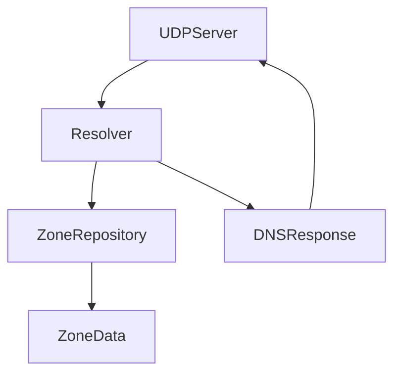

# uDNS

A lightweight, modern, CLEAN, and extensible golang DNS server.

# Introduction and Goals

uDNS is a lightweight, high-performance DNS server written in Go. It aims to provide a clean, testable implementation of a DNS resolver following the principles of CLEAN architecture and SOLID design. The project is suitable for local networks, containerized environments, embedded devices, and privacy-aware users seeking ad-blocking and custom resolution behavior.

## Requirements Overview

- Accept DNS queries over UDP (IPv4 and IPv6).
- Respond to A and AAAA queries with static zone data.
- Deliver minimal memory footprint and fast startup time.
- Log queries in structured format.
- Support extensibility (e.g., blocklists, web admin interface).

## Quality Goals

| Goal               | Motivation                                         |
|--------------------|----------------------------------------------------|
| Performance        | Fast response to DNS queries with minimal overhead |
| Simplicity         | Easy to configure and deploy                       |
| Testability        | Isolated unit testing of core services             |
| Maintainability    | Clean boundaries and clear responsibility per layer|
| Security           | Input validation and safe parsing of DNS payloads |

## Stakeholders

| Role/Name       | Contact                    | Expectations                                      |
|------------------|-----------------------------|---------------------------------------------------|
| Maintainer       | @haukened                  | Maintain a robust, well-architected DNS server    |
| Developers       | Contributors               | Easily contribute to a modular and testable codebase |
| Home users       | n/a                        | Simple DNS setup, privacy features, ad blocking   |
| DevOps Engineers | n/a                        | Lightweight resolver for container-based platforms |

# Architecture Constraints

- Must be written in Go.
- Must build into a single statically-linked binary.
- Follow CLEAN architecture boundaries.
- Must not pull in large runtime dependencies or DNS libraries.
- Logging must be structured and human-readable (`logger.Info({...}, "msg")`).

# Context and Scope

## Business Context

uDNS acts as a local DNS resolver for internal clients. It either serves DNS records from a local in-memory zone or passes through to upstream resolvers (future phase). It may also serve as a DNS sinkhole for ad/tracker blocking.

## Technical Context

- UDP server receives and parses requests.
- Query is forwarded to a Resolver service.
- Resolver queries zone records from a repository.
- Result is formatted into a DNS response and returned.

# Solution Strategy

- Use CLEAN architecture to separate domain logic, services, and infrastructure.
- All DNS logic is implemented in-house; no reliance on external parsing libraries.
- Minimal binary using Go's standard tooling.
- Use Go interfaces and DI for mockability and testability.

# Building Block View

## Whitebox Overall System

> For detailed information on the core domain types used throughout the architecture, see [`domain/domain.md`](../../internal/dns/domain/domain.md).

Motivation  
Maintain a modular, testable, and understandable DNS server architecture. Easy to extend with additional features like logging, metrics, blocklists.

Contained Building Blocks  
- `UDPServer`: Listens and responds on port 53
- `Resolver`: Interprets DNS queries and determines responses
- `ZoneRepository`: In-memory lookup of static DNS records
- `Logger`: Structured logging interface

Important Interfaces  
- `QueryResolver`: main service interface for DNS query handling
- `ZoneRepository`: abstraction over zone data (in-memory, later file or network)

### Black Box: UDPServer

- **Responsibility**: Listen for incoming DNS packets over UDP and forward them to the Resolver.
- **Interfaces**: None (entrypoint handler)
- **Uses**: `Resolver`, `DNSQuery`, `DNSResponse`
- **Exposes**: `StartListening()`
- **Location**: `internal/dns/infra/udp/server.go`

### Black Box: Resolver

- **Responsibility**: Accepts parsed queries, performs resolution logic, returns DNS responses.
- **Interfaces**: `QueryResolver`
- **Uses**: `ZoneRepository`, domain models
- **Exposes**: `Resolve(query DNSQuery) (DNSResponse, error)`
- **Location**: `internal/dns/service/resolver.go`

### Black Box: ZoneRepository

- **Responsibility**: Provide read access to zone records for a given query.
- **Interfaces**: `ZoneRepository`
- **Uses**: In-memory data store, eventually file or DB
- **Exposes**: `FindRecords(name string, qtype RRType) ([]ResourceRecord, error)`
- **Location**: `internal/dns/repo/static_repo.go`

### Black Box: Logger

- **Responsibility**: Emit structured, leveled logs for query lifecycle and system activity.
- **Interfaces**: `Logger` interface (`Info`, `Error`, `Debug`, `Warn`, `Panic`, `Fatal`)
- **Uses**: `zap` for production logging backend
- **Exposes**: `Configure(env, level)`, `SetLogger()`, and global logging functions (`Info`, `Warn`, etc.)
- **Location**: `internal/dns/infra/log/log.go`

### Black Box: Config

- **Responsibility**: Load environment-based configuration and apply schema validation.
- **Interfaces**: None (invoked directly during startup)
- **Uses**: `koanf` for env parsing, `validator` for field validation
- **Exposes**: `Load() (*AppConfig, error)`
- **Location**: `internal/dns/infra/config/config.go`

# Runtime View

## Incoming A/AAAA query

- UDPServer receives binary query.
- Parsed into a DNSQuery domain object.
- Resolver looks up name/type in ZoneRepository.
- DNSResponse is created and encoded.
- UDPServer sends response back to client.

# Deployment View

## Infrastructure Level 1

Motivation  
uDNS should be easy to run on Linux, inside Docker, or on embedded systems. No root requirements beyond port binding.

Quality and/or Performance Features  
- Fast startup
- Low memory
- Concurrent query handling via goroutines

Mapping of Building Blocks to Infrastructure  
- All services are compiled into `udnsd` binary.

# Cross-cutting Concepts

## Logging

- Use structured logging via `logger.Info(map[string]any{ "field": value }, "message")`

## Configuration

- Config loaded from env or CLI flags (e.g. `--zone-file`)

## Testability

- Domain and service layers are fully unit tested.
- Mock ZoneRepository in resolver tests.

# Architecture Decisions

- Chose Go for speed, simplicity, concurrency, and static binary builds.
- Implemented custom DNS parsing to maintain full control.
- Adopted CLEAN architecture for long-term maintainability and clarity.

# Quality Requirements

## Quality Tree

(tbd — can be added later as a Mermaid tree)

## Quality Scenarios

- uDNS should respond to 1000 QPS without dropping queries.
- uDNS should start in < 50ms.
- Zone records should be reloadable without restart (future).

# Risks and Technical Debts

- Current version does not validate malformed DNS messages.
- Does not support TCP fallback.
- In-memory zone is not reloadable yet.
- No privacy features yet for upstream resolvers, like DoH or DNS over TLS.

# Glossary

| Term             | Definition                                          |
|------------------|-----------------------------------------------------|
| Zone             | A mapping of DNS names to resource records          |
| Resource Record  | A typed DNS record (A, AAAA, CNAME, etc.)           |
| Resolver         | A component that answers DNS queries                |
| Query ID         | Unique identifier for matching request/response     |

# Acknowledgments

This documentation structure is based on the [arc42](https://arc42.org) architecture template by Dr. Peter Hruschka, Dr. Gernot Starke, and contributors.  
Arc42 is licensed under the [Creative Commons Attribution-ShareAlike 4.0 International License](https://creativecommons.org/licenses/by-sa/4.0/).