# RR-DNS

A lightweight, modern, CLEAN, and extensible golang DNS server.

# 1. Introduction and Goals

RR-DNS is a lightweight, high-performance DNS server written in Go. It aims to provide a clean, testable implementation of a DNS resolver following the principles of CLEAN architecture and SOLID design. The project is suitable for local networks, containerized environments, and privacy-aware users seeking ad-blocking and custom resolution behavior.

## Requirements Overview

- Accept DNS queries over UDP (IPv4 and IPv6).
- Respond to A and AAAA queries with static zone data.
- Deliver minimal memory footprint and fast startup time.
- Log queries in structured format.
- Support extensibility (e.g., blocklists, web admin interface).

## Quality Goals

| Goal               | Motivation                                         |
|--------------------|----------------------------------------------------|
| Performance        | Fast response to DNS queries with minimal overhead |
| Simplicity         | Easy to configure and deploy                       |
| Testability        | Isolated unit testing of core services             |
| Maintainability    | Clean boundaries and clear responsibility per layer|
| Security           | Input validation and safe parsing of DNS payloads |

## Stakeholders

| Role/Name       | Contact                    | Expectations                                      |
|------------------|-----------------------------|---------------------------------------------------|
| Maintainer       | @haukened                  | Maintain a robust, well-architected DNS server    |
| Developers       | Contributors               | Easily contribute to a modular and testable codebase |
| Home users       | n/a                        | Simple DNS setup, privacy features, ad blocking   |
| DevOps Engineers | n/a                        | Lightweight resolver for container-based platforms |

# 2. Architecture Constraints

- Must be written in Go.
- Must build into a single statically-linked binary.
- Follow CLEAN architecture boundaries.
- Must not pull in large runtime dependencies or DNS libraries.
- Logging must be structured and human-readable (`logger.Info({...}, "msg")`).

# 3. Context and Scope

## 3.1 Business Context


RR-DNS acts as a local DNS resolver for internal clients. It either serves DNS records from a local in-memory zone or passes through to upstream resolvers (future phase). It may also serve as a DNS sinkhole for ad/tracker blocking.

## 3.2 Technical Context


- UDP server receives and parses requests.
- Query is forwarded to a Resolver service.
- Resolver first checks local zone records from repository.
- If not found locally, resolver checks DNS block list for blocked domains.
- If not blocked and not in zones, resolver checks DNS cache.
- If cache miss, resolver forwards query to upstream DNS servers via upstream resolver.
- Resolver receives upstream response and caches it before returning to client.
- All query processing steps are logged for monitoring and debugging.
- Response is returned to client with optimal latency.

Since mermaid diagrams don't guarantee ordering, to eliminate ambiguity, the query resolver orders steps:


# 4. Solution Strategy

- Use CLEAN architecture to separate domain logic, services, and infrastructure.
- All DNS logic is implemented in-house; no reliance on external parsing libraries.
- Minimal binary using Go's standard tooling.
- Use Go interfaces and DI for mockability and testability.

# 5. Building Block View

This section shows the static decomposition of RR-DNS into building blocks and their dependencies. The view follows a hierarchical structure showing the system at different levels of detail.

## 5.1 Whitebox Overall System

***Overview Diagram***


***Motivation***

RR-DNS follows CLEAN architecture principles with clear separation between domain logic, application services, and infrastructure concerns. This ensures testability, maintainability, and allows for easy extension with additional features.

***Contained Building Blocks***

| **Building Block** | **Responsibility** |
|--------------------|--------------------|
| Domain Models | Pure domain entities representing DNS concepts (queries, responses, records) |
| Query Resolver | Core business logic for DNS query resolution |
| UDP Server | Network protocol handling and packet parsing |
| Zone Loader | Loading and parsing zone files from disk |
| DNS Cache | In-memory LRU cache for performance optimization |
| Upstream Resolver | Forward queries to external DNS servers when no local data available |
| DNS Block List | Block malicious/unwanted domains using cached database lookups |
| Logger | Structured logging across all components |
| Configuration | Environment-based configuration management |

***Important Interfaces***

- `QueryResolver` interface: Main service contract for DNS resolution
- `ZoneRepository` interface: Abstraction for zone data access
- `CacheRepository` interface: Abstraction for cached record storage
- `BlockListRepository` interface: Abstraction for domain blocking decisions

## 5.2 Level 2

### 5.2.1 White Box: Domain Layer

***Overview Diagram***


***Motivation***

The domain layer contains pure business entities free from infrastructure concerns. These types serve as contracts between layers and ensure type safety across the system.

***Contained Building Blocks***

| **Name** | **Responsibility** |
|----------|-------------------|
| DNSQuery | Represents incoming DNS questions from clients |
| DNSResponse | Complete DNS response with answers, authority, and additional sections |
| ResourceRecord | Cached DNS records with expiration timestamps |
| AuthoritativeRecord | Zone file records with TTL for authoritative responses |
| RRType | DNS record types (A, AAAA, MX, etc.) |
| RRClass | DNS classes (typically IN) |
| RCode | DNS response codes (NOERROR, NXDOMAIN, etc.) |

> For detailed domain model documentation, see [`internal/dns/domain/00_domain.md`](../../internal/dns/domain/00_domain.md)

### 5.2.2 White Box: Infrastructure Layer

***Overview Diagram***

> Note: The infrastructure layer is intentionally disconnected. Infrastucture is stitched together at the service layer, and should have no cross dependencies.


***Motivation***

Infrastructure components handle external concerns like networking, file I/O, caching, and logging. They are designed to be replaceable and testable through interfaces. Configuration and logging are orchestrated by the service layer to maintain clean architectural boundaries.

***Contained Building Blocks***

| **Name** | **Responsibility** |
|----------|-------------------|
| UDP Server | Listen for DNS packets, parse protocol, delegate to resolver |
| Zone Loader | Load and parse zone files (YAML/JSON/TOML) into domain objects |
| DNS Cache | LRU cache for DNS records to improve query performance |
| DNS Block List | Domain blocking with LRU cache over lightweight database |
| Logger | Structured logging with configurable levels and output formats |
| Configuration | Load and validate configuration from environment variables |

## 5.3 Level 3

### 5.3.1 Black Box: Zone Loader

***Purpose/Responsibility***
- Load DNS zone files from a configured directory
- Support multiple formats: YAML, JSON, TOML
- Parse zone data into `AuthoritativeRecord` domain objects
- Handle file format validation and error reporting

***Interface***
```go
func LoadZoneDirectory(dir string, defaultTTL time.Duration) ([]*domain.AuthoritativeRecord, error)
```

***Quality/Performance Characteristics***
- Loads all zone files at startup (not runtime)
- Fails fast on invalid zone files
- Memory efficient parsing using streaming where possible

***Directory/File Location***
`internal/dns/infra/zone/zone.go`

***Zone File Format***
- Each file must contain a `zone_root` field
- Labels are expanded to FQDNs using the zone root
- Supported formats: `.yaml`, `.yml`, `.json`, `.toml`

**Example YAML:**
```yaml
zone_root: example.com
www:
  A: 
    - "1.2.3.4"
    - "5.6.7.8"
mail:
  MX: "mail.example.com"
```

### 5.3.2 Black Box: DNS Cache

***Purpose/Responsibility***
- Provide fast, in-memory LRU cache for DNS resource records
- Reduce lookup latency and zone file access
- Thread-safe operations for concurrent queries
- Automatic expiration based on TTL

***Interface***
```go
type Cache interface {
    Get(key string) ([]domain.ResourceRecord, bool)
    Put(key string, records []domain.ResourceRecord, ttl time.Duration)
    Delete(key string)
    Clear()
    Size() int
}
```

***Quality/Performance Characteristics***
- LRU eviction policy
- Configurable cache size
- Thread-safe for concurrent access
- O(1) average case performance

***Directory/File Location***
`internal/dns/infra/dnscache/dnscache.go`

***Uses***
- [`github.com/hashicorp/golang-lru/v2`](https://github.com/hashicorp/golang-lru) for LRU implementation

### 5.3.3 Black Box: Configuration

***Purpose/Responsibility***
- Load configuration from environment variables
- Validate configuration values using struct tags
- Provide defaults for optional settings
- Support multiple data types (strings, integers, arrays)

***Interface***
```go
type AppConfig struct {
    CacheSize uint     `koanf:"cache_size" validate:"required,gte=1"`
    Env       string   `koanf:"env" validate:"required,oneof=dev prod"`
    LogLevel  string   `koanf:"log_level" validate:"required,oneof=debug info warn error"`
    Port      int      `koanf:"port" validate:"required,gte=1,lt=65535"`
    ZoneDir   string   `koanf:"zone_dir" validate:"required"`
    Upstream  []string `koanf:"upstream" validate:"required,dive,hostname_port"`
}

func Load() (*AppConfig, error)
```

***Quality/Performance Characteristics***
- Validation on load with clear error messages
- Environment variable prefix: `UDNS_`
- Case-insensitive key transformation

***Directory/File Location***
`internal/dns/infra/config/config.go`

***Configuration Options***
- `UDNS_CACHE_SIZE`: DNS cache size (default: 1000)
- `UDNS_ENV`: Runtime environment "dev" or "prod" (default: "prod")
- `UDNS_LOG_LEVEL`: Log level (default: "info")
- `UDNS_PORT`: DNS server port (default: 53)
- `UDNS_ZONE_DIR`: Zone files directory (default: "/etc/rr-dns/zones/")
- `UDNS_UPSTREAM`: Upstream DNS servers (default: "1.1.1.1:53,1.0.0.1:53")

### 5.3.4 Black Box: Logger

***Purpose/Responsibility***
- Provide structured logging across all components
- Support multiple log levels and output formats
- Configure logging based on environment (dev/prod)
- Thread-safe logging operations

***Interface***
```go
func Configure(env, logLevel string)
func Info(fields map[string]any, msg string)
func Error(fields map[string]any, msg string)
func Debug(fields map[string]any, msg string)
func Warn(fields map[string]any, msg string)
func Panic(fields map[string]any, msg string)
func Fatal(fields map[string]any, msg string)
```

***Quality/Performance Characteristics***
- Structured JSON logging in production
- Human-readable console logging in development
- High performance with minimal allocations
- Non-blocking log operations

***Directory/File Location***
`internal/dns/infra/log/log.go`

***Uses***
- [`go.uber.org/zap`](https://github.com/uber-go/zap) for high-performance logging

##### 5.3.5 Black Box: Upstream Resolver

| Aspect | Description |
|--------|-------------|
| **Purpose** | Resolves DNS queries for domains not served locally by forwarding to upstream DNS servers |
| **Interface** | • Input: DNS query (name, type, class)<br>• Output: DNS response or resolution failure |
| **Location** | Implements the interface defined in the Domain Layer for external DNS resolution |

The Upstream Resolver implements the forwarding logic for queries that cannot be satisfied by local zones, providing the bridge to the wider DNS infrastructure.

##### 5.3.6 Black Box: DNS Block List

| Aspect | Description |
|--------|-------------|
| **Purpose** | Provides domain blocking functionality for ad-blocking, malware protection, and content filtering |
| **Interface** | • Input: Domain name to check<br>• Output: Boolean blocked status with optional block reason |
| **Architecture** | Two-tier storage: LRU cache for hot domains over lightweight database for complete block lists |

***Storage Strategy***
- **L1 Cache**: In-memory LRU cache for frequently queried domains (blocked and allowed)
- **L2 Storage**: Lightweight embedded database (SQLite/BadgerDB) for complete block lists
- **Cache-aside pattern**: Check cache first, fallback to database, populate cache with result

***Performance Characteristics***
- Sub-millisecond lookup for cached domains
- Configurable cache size to balance memory vs hit ratio
- Asynchronous block list updates without service interruption
- Batch database operations for efficient block list loading

***Block List Sources***
- Support for multiple block list formats (hosts files, domain lists, wildcards)
- Periodic updates from external sources (URLs, files)
- Local custom block/allow lists with higher precedence
- Category-based blocking (ads, trackers, malware, adult content)

***Directory/File Location***
`internal/dns/infra/blocklist/blocklist.go`

# 6. Runtime View

## 6.1 Incoming A/AAAA query

- UDPServer receives binary query.
- Parsed into a DNSQuery domain object.
- Resolver looks up name/type in ZoneRepository.
- DNSResponse is created and encoded.
- UDPServer sends response back to client.


# 7. Deployment View

## 7.1 Infrastructure Level 1


Motivation  
RR-DNS should be easy to run on Linux, inside Docker, or on embedded systems. No root requirements beyond port binding.

Quality and/or Performance Features  
- Fast startup
- Low memory
- Concurrent query handling via goroutines

Mapping of Building Blocks to Infrastructure  
- All services are compiled into `rrdnsd` binary.

# 8. Cross-cutting Concepts

This section describes overall principles and solution patterns that are relevant across multiple building blocks of RR-DNS. These concepts ensure consistency, quality, and maintainability throughout the system.

## 8.1 Domain Model Concepts

### DNS-Specific Domain Rules
- All domain names must be fully qualified (end with `.`)
- TTL values are preserved from authoritative records and converted to expiration timestamps for cached records
- Resource records are immutable once created
- Query matching is case-insensitive for domain names
- All DNS wire format parsing and generation follows RFC 1035 specifications

### Domain Layer Principles
- Pure domain entities with no infrastructure dependencies
- Validation occurs at domain boundaries
- Domain types serve as contracts between architectural layers
- No side effects (logging, networking) in domain logic

### Entity Relationships
```go
// Example: Converting authoritative to cached records
func NewResourceRecordFromAuthoritative(ar *AuthoritativeRecord, now time.Time) *ResourceRecord {
    return &ResourceRecord{
        Name:      ar.Name,
        Type:      ar.Type,
        Class:     ar.Class,
        ExpiresAt: now.Add(time.Duration(ar.TTL) * time.Second),
        Data:      ar.Data,
    }
}
```

## 8.2 Security Concepts

### Input Validation
- All DNS queries are validated for proper format before processing
- Domain names are sanitized and normalized
- Query types and classes are validated against supported values
- Maximum query size limits are enforced

### DNS Security Measures
- Rate limiting per client IP to prevent DoS attacks
- Query logging for security monitoring and auditing
- Validation of upstream DNS responses before caching
- Protection against DNS cache poisoning through strict response validation

### Error Information Disclosure
- Error messages do not expose internal system details
- DNS errors are mapped to appropriate RCodes (SERVFAIL, NXDOMAIN, etc.)
- Detailed error information is logged but not returned to clients

## 8.3 Error Handling and Resilience

### Error Handling Strategy
- **Domain Layer**: Returns validation errors for invalid inputs
- **Service Layer**: Converts domain errors to appropriate DNS response codes
- **Infrastructure Layer**: Handles network errors, file I/O errors, and external dependencies

### Error Types and Responses
| Error Type | DNS RCode | Action |
|------------|-----------|---------|
| Invalid query format | FORMERR | Log and respond with error |
| Unsupported query type | NOTIMP | Log and respond with error |
| Zone lookup failure | SERVFAIL | Log error, attempt upstream if configured |
| Non-existent domain | NXDOMAIN | Return negative response |
| Internal system error | SERVFAIL | Log detailed error, return generic failure |

### Fallback Mechanisms
- Cache miss → Zone lookup → Upstream query (if configured)
- Zone file parsing errors → Log error, continue with other files
- Upstream DNS failure → Return SERVFAIL, cache failure for short period

## 8.4 Logging and Monitoring

### Structured Logging Pattern
```go
log.Info(map[string]any{
    "query_id":    query.ID,
    "client_ip":   clientIP,
    "query_name":  query.Name,
    "query_type":  query.Type.String(),
    "response_code": response.RCode.String(),
    "duration_ms": duration.Milliseconds(),
}, "DNS query processed")
```

### Logging Levels
- **Debug**: Internal state, cache hits/misses, detailed flow
- **Info**: Successful operations, query processing, startup/shutdown
- **Warn**: Recoverable errors, fallbacks, configuration issues
- **Error**: System failures, invalid configurations, unrecoverable errors
- **Fatal**: Critical errors that require process termination

### Monitoring Points
- Query response times and throughput
- Cache hit/miss ratios
- Upstream DNS response times
- Error rates by type
- Memory usage and cache size

## 8.5 Configuration Management

### Environment-Based Configuration
- All configuration through environment variables with `UDNS_` prefix
- Configuration validation at startup with clear error messages
- Immutable configuration during runtime (no hot reloading)
- Sensible defaults for all optional settings

### Configuration Categories
```go
type AppConfig struct {
    // Server Configuration
    Port      int      `koanf:"port" validate:"required,gte=1,lt=65535"`
    
    // Performance Configuration  
    CacheSize uint     `koanf:"cache_size" validate:"required,gte=1"`
    
    // Operational Configuration
    Env       string   `koanf:"env" validate:"required,oneof=dev prod"`
    LogLevel  string   `koanf:"log_level" validate:"required,oneof=debug info warn error"`
    
    // Zone Configuration
    ZoneDir   string   `koanf:"zone_dir" validate:"required"`
    
    // Upstream Configuration
    Upstream  []string `koanf:"upstream" validate:"required,dive,hostname_port"`
}
```

## 8.6 Performance and Caching

### Caching Strategy
- **L1 Cache**: In-memory LRU cache for frequently accessed records
- **Cache Keys**: Generated from query name, type, and class
- **TTL Handling**: Respect original TTL values, expire based on timestamps
- **Cache Size**: Configurable limit with LRU eviction

### Memory Management
- Avoid unnecessary allocations in hot paths
- Reuse byte buffers for DNS packet parsing
- Efficient string operations for domain name processing
- Bounded cache size to prevent memory exhaustion

### Concurrency Patterns
```go
// DNS Cache uses hashicorp/golang-lru/v2 which is already thread-safe
func (c *dnsCache) Get(key string) ([]domain.ResourceRecord, bool) {
    // No manual locking needed - LRU cache handles concurrency internally
    return c.cache.Get(key)
}

// Other concurrency patterns in the system
func (s *UDPServer) handleQuery(conn *net.UDPConn, addr *net.UDPAddr, data []byte) {
    // Each query handled in its own goroutine for concurrent processing
    go func() {
        query, err := parseQuery(data)
        if err != nil {
            // Handle error
            return
        }
        response := s.resolver.Resolve(query)
        sendResponse(conn, addr, response)
    }()
}
```

## 8.7 Testing Concepts

### Testing Strategy
- **Unit Tests**: All domain logic and individual components
- **Integration Tests**: Component interactions and external dependencies
- **Mock Interfaces**: Infrastructure dependencies are mockable
- **Test Data**: Consistent test zone files and DNS queries

### Testing Patterns
```go
// Example: Mocking external dependencies
type MockZoneRepository struct {
    records map[string][]domain.AuthoritativeRecord
}

func (m *MockZoneRepository) FindRecords(name string, qtype domain.RRType) ([]domain.AuthoritativeRecord, error) {
    // Mock implementation
}
```

### Test Coverage Requirements
- Domain layer: 100% test coverage (pure logic)
- Service layer: >95% test coverage including error paths
- Infrastructure layer: Integration tests for external dependencies

## 8.8 Development and Build Concepts

### Code Organization
- **Clean Architecture**: Strict dependency direction (Infra → Service → Domain)
- **Interface Segregation**: Small, focused interfaces
- **Dependency Injection**: Constructor injection for testability

### Build and Deployment
- Single statically-linked binary
- No runtime dependencies beyond the Go standard library
- Cross-platform compilation support
- Minimal Docker image based on scratch or distroless

# 9. Architecture Decisions

- Chose Go for speed, simplicity, concurrency, and static binary builds.
- Implemented custom DNS parsing to maintain full control.
- Adopted CLEAN architecture for long-term maintainability and clarity.

# 10. Quality Requirements

## 10.1 Quality Tree

The quality tree shows the hierarchical breakdown of quality requirements for RR-DNS, with the most important qualities at the top level and specific attributes as branches.

```mermaid
graph TD
    Quality[RR-DNS Quality]
    
    Quality --> Performance[Performance<br/>🔥 High Priority]
    Quality --> Reliability[Reliability<br/>🔥 High Priority] 
    Quality --> Usability[Usability<br/>🟡 Medium Priority]
    Quality --> Maintainability[Maintainability<br/>🟡 Medium Priority]
    Quality --> Security[Security<br/>🟢 Important]
    Quality --> Portability[Portability<br/>🟢 Important]
    
    Performance --> ResponseTime[Response Time<br/>< 5ms average]
    Performance --> Throughput[Throughput<br/>1000+ QPS]
    Performance --> MemoryUsage[Memory Usage<br/>< 50MB RAM]
    Performance --> StartupTime[Startup Time<br/>< 50ms]
    Performance --> CacheEfficiency[Cache Hit Ratio<br/>> 80%]
    
    Reliability --> Availability[Availability<br/>99.9% uptime]
    Reliability --> ErrorHandling[Error Recovery<br/>Graceful degradation]
    Reliability --> DataIntegrity[Data Integrity<br/>Correct DNS responses]
    Reliability --> Resilience[Fault Tolerance<br/>Continue on zone errors]
    
    Usability --> Configuration[Configuration<br/>Environment variables]
    Usability --> Logging[Observability<br/>Structured logs]
    Usability --> Documentation[Documentation<br/>Clear setup guide]
    Usability --> Deployment[Easy Deployment<br/>Single binary]
    
    Maintainability --> Testability[Testability<br/>95%+ test coverage]
    Maintainability --> Modularity[Clean Architecture<br/>SOLID principles]
    Maintainability --> CodeQuality[Code Quality<br/>Linting, formatting]
    Maintainability --> Extensibility[Extensibility<br/>Plugin interfaces]
    
    Security --> InputValidation[Input Validation<br/>DNS packet validation]
    Security --> RateLimiting[Rate Limiting<br/>DoS protection]
    Security --> AuditLogging[Audit Logging<br/>Query tracking]
    Security --> MinimalAttackSurface[Attack Surface<br/>No external deps]
    
    Portability --> CrossPlatform[Cross Platform<br/>Linux, macOS, Windows]
    Portability --> ContainerSupport[Containers<br/>Docker, Kubernetes]
    Portability --> EmbeddedSystems[Embedded<br/>ARM, low resource]
    Portability --> StaticBinary[Static Binary<br/>No runtime deps]
```



### Quality Priorities

**🔥 High Priority (Critical for DNS server operation)**
- **Performance**: DNS queries must be answered quickly and efficiently
- **Reliability**: DNS service must be consistently available and accurate

**🟡 Medium Priority (Important for operational success)**
- **Usability**: Easy to deploy, configure, and monitor
- **Maintainability**: Long-term code sustainability and evolution

**🟢 Important (Enabling deployment scenarios)**
- **Security**: Protection against common DNS attacks and threats
- **Portability**: Support for diverse deployment environments

### Quality Attribute Relationships

- **Performance ↔ Security**: Rate limiting may impact performance but improves security
- **Reliability ↔ Performance**: Error handling overhead vs response time optimization
- **Maintainability ↔ Performance**: Clean code structure vs micro-optimizations
- **Usability ↔ Security**: Simple configuration vs comprehensive security options

## 10.2 Quality Scenarios

- RR-DNS should respond to 1000 QPS without dropping queries.
- RR-DNS should start in < 50ms.
- Zone records should be reloadable without restart (future).

# 11. Risks and Technical Debts

- Current version does not validate malformed DNS messages.
- Does not support TCP fallback.
- In-memory zone is not reloadable yet.
- No privacy features yet for upstream resolvers, like DoH or DNS over TLS.

# 12. Glossary

| Term             | Definition                                          |
|------------------|-----------------------------------------------------|
| Zone             | A mapping of DNS names to resource records          |
| Resource Record  | A typed DNS record (A, AAAA, CNAME, etc.)           |
| Resolver         | A component that answers DNS queries                |
| Query ID         | Unique identifier for matching request/response     |


# Acknowledgments

This documentation structure is based on the [arc42](https://arc42.org) architecture template by Dr. Peter Hruschka, Dr. Gernot Starke, and contributors.  
Arc42 is licensed under the [Creative Commons Attribution-ShareAlike 4.0 International License](https://creativecommons.org/licenses/by-sa/4.0/).