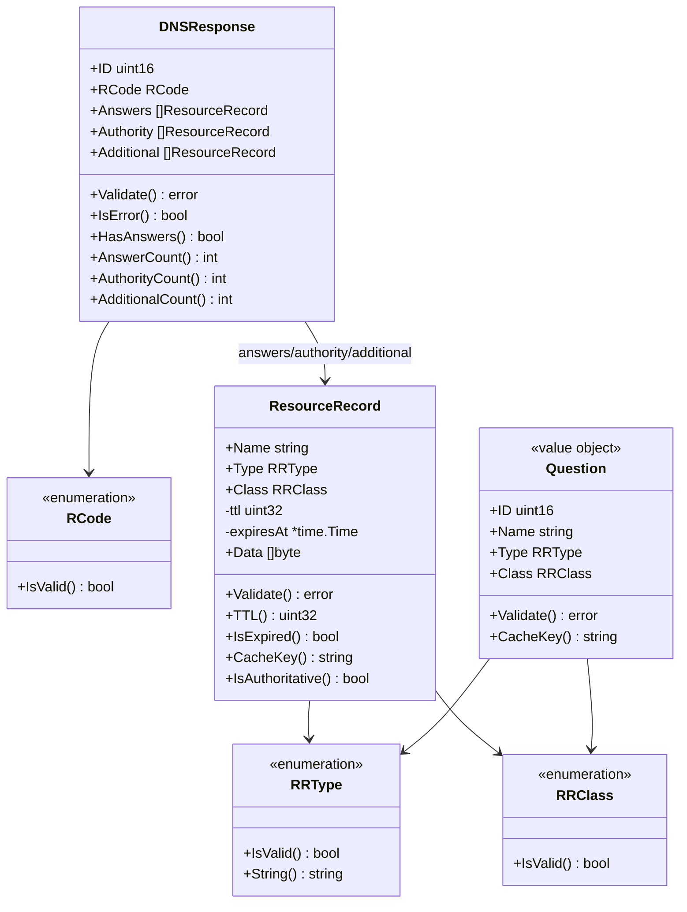
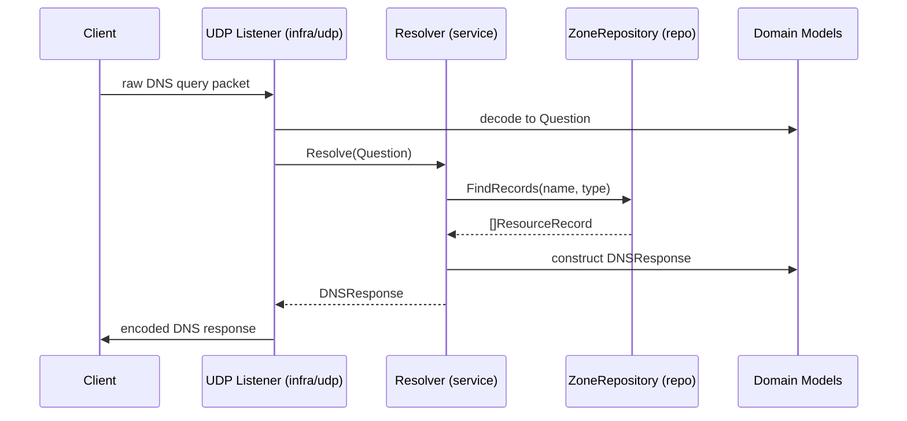

# RR-DNS Domain Model

This document defines the core domain entities used in RR-DNS. These types are pure Go structures representing validated DNS data and responses, free of infrastructure, protocol, or side effects. They form the core contracts across the system and are designed to support CLEAN architecture and testability.

---

## Table of Contents

- [Domain Philosophy](#domain-philosophy)
- [Top-Level Entities](#top-level-entities)
- [Question](#question)
- [DNSResponse](#dnsresponse)
- [ResourceRecord](#resourcerecord)
- [RRType](#rrtype)
- [RRClass](#rrclass)
- [RCode](#rcode)
- [Entity Relationships](#entity-relationships)
- [Example Request/Response Flow](#example-requestresponse-flow)

---

## Domain Philosophy

- All domain types must be pure data: no logging, networking, or side effects
- All domain logic must be deterministic and validation-driven
- Domain types should be easy to construct, compare, serialize, and test
- No dependency on services, infrastructure, or external libraries
- Serve as the shared boundary contract across layers (e.g. service <-> infra)

---


## Top-Level Entities

- `Question` – an incoming question from a client
- `DNSResponse` – a full structured response (including Answers, Authority, Additional)
- `ResourceRecord` – a unified DNS RR type supporting both cached and authoritative records
- `RRType` – DNS record types (A, AAAA, NS, etc.)
- `RRClass` – DNS classes (typically IN)
- `RCode` – response codes (NOERROR, NXDOMAIN, SERVFAIL, etc.)

---

## Question

Represents a single question section from a DNS request, as defined in [RFC 1035 §4.1.2](https://datatracker.ietf.org/doc/html/rfc1035#section-4.1.2).

**Fields:**
- `ID`: 16-bit query identifier (used to match the response)
- `Name`: Fully-qualified domain name (FQDN), e.g., `example.com.`
- `Type`: RRType (see list below)
- `Class`: RRClass (see list below)

**Example:**

```go
q, err := NewQuestion(12345, "example.com.", RRTypeA, RRClassIN)
if err != nil {
  // handle validation error
}
```

**Supported Types (RRType):**  
Per [IANA DNS Parameters – Resource Record Types](https://www.iana.org/assignments/dns-parameters/dns-parameters.xhtml#dns-parameters-4)

| Name     | Code | Description         |
|----------|------|---------------------|
| A        | 1    | IPv4 address        |
| AAAA     | 28   | IPv6 address        |
| CNAME    | 5    | Canonical name      |
| MX       | 15   | Mail exchange       |
| NS       | 2    | Name server         |
| PTR      | 12   | Domain name pointer |
| SOA      | 6    | Start of authority  |
| SRV      | 33   | Service locator     |
| TXT      | 16   | Text record         |
| ANY      | 255  | Wildcard query (meta-query)

**Supported Classes (RRClass):**  
Per [RFC 1035 §3.2.4](https://datatracker.ietf.org/doc/html/rfc1035#section-3.2.4)

| Name | Code | Description              |
|------|------|--------------------------|
| IN   | 1    | Internet (default class) |
| CH   | 3    | Chaos (legacy)           |
| HS   | 4    | Hesiod (legacy)          |
| ANY  | 255  | Wildcard query (meta-query)

**Constraints:**
- `Name` must be a valid FQDN and must not be empty
- `Type` must be a recognized RRType
- `Class` must be a recognized RRClass

---

## DNSResponse

Represents the entire response to a DNS query, as defined in [RFC 1035 §4.1.1](https://datatracker.ietf.org/doc/html/rfc1035#section-4.1.1).

**Fields:**
- `ID`: Must match `Question.ID`
- `RCode`: DNS response code (see RCode section)
- `Answers`: Answer records that directly answer the query
- `Authority`: Records describing the authoritative source
- `Additional`: Additional helpful records (e.g. glue records)

**Constructor:**
```go
func NewDNSResponse(id uint16, rcode RCode, answers, authority, additional []ResourceRecord) (DNSResponse, error)
```

**Validation:**
- Validates that RCode is within supported range
- Validates all ResourceRecord entries in each section (Answers, Authority, Additional)
- Returns detailed error messages for invalid records with section and index information

**Utility Methods:**
- `Validate()`: Validates the entire response structure
- `IsError()`: Returns true if RCode indicates an error condition (non-zero)
- `HasAnswers()`: Returns true if the response contains answer records
- `AnswerCount()`: Returns the number of answer records
- `AuthorityCount()`: Returns the number of authority records  
- `AdditionalCount()`: Returns the number of additional records

**Field Details:**

- `Authority`:  
  This section typically contains `NS` or `SOA` records that identify the authoritative source for the queried domain. It is used to indicate which server is authoritative or to supply zone-level metadata in negative responses (e.g. NXDOMAIN, NXRRSET).

- `Additional`:  
  This section provides helpful extra records that clients might need to use the answer or authority data without additional queries. Common examples include glue records (A/AAAA for `NS` or `SRV` targets) or `OPT` pseudo-records for EDNS0.

**Supported RCodes (Response Codes):**  
Per [RFC 1035 §4.1.1](https://datatracker.ietf.org/doc/html/rfc1035#section-4.1.1) and [RFC 6895](https://datatracker.ietf.org/doc/html/rfc6895)

| Name      | Code | Meaning                          |
|-----------|------|----------------------------------|
| NOERROR   | 0    | No error                         |
| FORMERR   | 1    | Format error                     |
| SERVFAIL  | 2    | Server failure                   |
| NXDOMAIN  | 3    | Non-existent domain              |
| NOTIMP    | 4    | Not implemented                  |
| REFUSED   | 5    | Query refused                    |
| YXDOMAIN  | 6    | Name exists when it should not   |
| YXRRSET   | 7    | RR Set exists when it should not |
| NXRRSET   | 8    | RR Set that should exist does not|
| NOTAUTH   | 9    | Server not authoritative         |
| NOTZONE   | 10   | Name not inside zone             |

**Constraints:**
- Response must conform to RFC 1035 structure
- All ResourceRecord entries must be valid
- RCode must be one of the supported values listed above
- ID should match the corresponding Question ID

**Example:**

```go
// Create resource record for answer
rr, _ := NewAuthoritativeResourceRecord("example.com.", RRTypeA, RRClassIN, 300, []byte{192, 0, 2, 1}, "192.0.2.1")

// Create DNS response
resp, err := NewDNSResponse(12345, 0, []ResourceRecord{rr}, nil, nil)
if err != nil {
    // Handle validation error
}

// The response structure:
// DNSResponse{
//   ID: 12345,
//   RCode: 0, // NOERROR
//   Answers: []ResourceRecord{rr},
//   Authority: []ResourceRecord{},
//   Additional: []ResourceRecord{},
// }
```

---


## ResourceRecord

Represents a unified DNS resource record that supports both cached and authoritative use cases. The behavior (authoritative vs cached) is determined by which constructor is used (presence of an expiration time). A record now carries two complementary representations of its RDATA:

1. `Data` – canonical wire-format bytes used for encoding/decoding DNS messages
2. `Text` – the original human-readable form (as sourced from a zone file or upstream parsing) used for higher‑level logic (e.g. CNAME chase, logging, future policy validation) without re‑decoding bytes

At least one of `Data` or `Text` must be present; both may be set. For authoritative zone loading we typically populate both (wire bytes + textual literal). For upstream cached records we may decode bytes back into a canonical textual form and store both.

Keeping both forms avoids lossy round‑trips and eliminates repeated decode work while preserving fidelity of the original zone content.

**Fields (exported + notable unexported):**
- `Name`: FQDN this record applies to (canonicalized: lower‑cased, ensured trailing dot)
- `Type`: RRType
- `Class`: RRClass
- `Data`: Raw RDATA bytes (wire format). May be empty if textual-only (e.g. during construction before encoding) but normally present.
- `Text`: Human-readable representation (e.g. "192.0.2.1", "mail.example.com.", full SOA fields serialized, etc.)
- `ttl` (private): Original TTL in seconds
- `expiresAt` (private): Expiration timestamp for cached records (`nil` for authoritative)

**Constructors (updated – added `text string` parameter):**

Authoritative (non‑expiring):
```go
func NewAuthoritativeResourceRecord(name string, rrtype RRType, class RRClass, ttl uint32, data []byte, text string) (ResourceRecord, error)
```

Cached (expiring):
```go
func NewCachedResourceRecord(name string, rrtype RRType, class RRClass, ttl uint32, data []byte, text string, now time.Time) (ResourceRecord, error)
```

**Validation Rules:**
- `Name` must be non‑empty and valid
- `Type` and `Class` must be valid enumerations
- At least one of `Text` or `Data` must be non‑empty (prevents constructing meaningless empty records)

**Key Methods:**
- `Validate()` – applies rules above
- `TTL()` – effective TTL for wire output (remaining time for cached, original for authoritative)
- `TTLRemaining()` – duration form of remaining TTL (authoritative returns original duration)
- `IsExpired()` – true only for cached records whose `expiresAt` is in the past
- `IsAuthoritative()` – true if `expiresAt == nil`
- `CacheKey()` – normalized lookup key (name|type|class)

**Authoritative vs Cached Behavior:**
- Authoritative: Constructed via `NewAuthoritativeResourceRecord`; immutable; `expiresAt == nil`; `TTL()` always returns original TTL.
- Cached: Constructed via `NewCachedResourceRecord`; `expiresAt` calculated as `now + ttl`; `TTL()` decreases over time until 0; `IsExpired()` guards eviction.

**Design Notes (Dual Representation Rationale):**
- Avoids re‑decoding binary RDATA for operations that need the semantic value (e.g. following a CNAME target)
- Preserves the original textual form from zone files for faithful round‑trips and potential re‑generation
- Enables validation/policy checks (e.g. detecting illegal co‑existence, enforcing formatting) without byte parsing overhead
- Supports future features like structured logging and metrics tagged by exact textual RDATA

**Examples**

Authoritative A record (zone load):
```go
rr, err := NewAuthoritativeResourceRecord(
  "example.com.",
  RRTypeA,
  RRClassIN,
  300,
  []byte{192, 0, 2, 1}, // wire form 192.0.2.1
  "192.0.2.1",          // textual form
)
```

Cached MX record (obtained from upstream):
```go
mxWire := []byte{0x00, 0x0a /* preference 10 */, /* encoded exchange labels ... */ }
rr, err := NewCachedResourceRecord(
  "example.com.",
  RRTypeMX,
  RRClassIN,
  600,
  mxWire,
  "10 mail.example.com.",
  time.Now(),
)
```

Text‑only provisional construction (later filled with Data after encoding):
```go
txt := "v=spf1 -all"
wire := encodeTXT(txt) // hypothetical helper producing []byte
rr, err := NewAuthoritativeResourceRecord("example.com.", RRTypeTXT, RRClassIN, 300, wire, txt)
```

When either `Data` or `Text` is intentionally omitted (rare), callers must ensure the missing representation can be derived before use in layers that require it.

---

## RRType

**Note:** RR-DNS currently supports a subset of defined RRTypes. For the full authoritative list, see [IANA RRTypes](https://www.iana.org/assignments/dns-parameters/dns-parameters.xhtml#dns-parameters-4).

DNS Resource Record Types as defined by [IANA](https://www.iana.org/assignments/dns-parameters/dns-parameters.xhtml#dns-parameters-4)

| Name     | Code | Description         |
|----------|------|---------------------|
| A        | 1    | IPv4 address        |
| NS       | 2    | Name server         |
| CNAME    | 5    | Canonical name      |
| SOA      | 6    | Start of authority  |
| PTR      | 12   | Domain name pointer |
| MX       | 15   | Mail exchange       |
| TXT      | 16   | Text record         |
| AAAA     | 28   | IPv6 address        |
| SRV      | 33   | Service locator     |
| OPT      | 41   | EDNS0 option        |
| CAA      | 257  | Certification Authority Authorization |

- `OPT` (code 41) is a pseudo-record used for EDNS(0) extensions. It only appears in the Additional section and does not behave like traditional records.
- `ANY` (code 255) is a meta-query type. Many resolvers restrict or refuse ANY queries in practice.

---

## RRClass

**Note:** Most DNS traffic uses class `IN`. Other classes are included for completeness. See [IANA RR Classes](https://www.iana.org/assignments/dns-parameters/dns-parameters.xhtml#dns-parameters-2).

DNS Resource Record Classes per RFC 1035

| Name | Code | Description         |
|------|------|---------------------|
| IN   | 1    | Internet             |
| CH   | 3    | Chaos (obsolete)     |
| HS   | 4    | Hesiod (obsolete)    |
| ANY  | 255  | Wildcard match class |

**Note:** Most DNS traffic uses class `IN`.

---

## RCode

**Note:** This list includes only the most common RCode values. For a complete list of extended response codes, see [IANA RCODE Assignments](https://www.iana.org/assignments/dns-parameters/dns-parameters.xhtml#dns-parameters-6).

Response Codes per RFC 1035 and RFC 6895

| Name      | Code | Meaning                          |
|-----------|------|----------------------------------|
| NOERROR   | 0    | No error                         |
| FORMERR   | 1    | Format error                     |
| SERVFAIL  | 2    | Server failure                   |
| NXDOMAIN  | 3    | Non-existent domain              |
| NOTIMP    | 4    | Not implemented                  |
| REFUSED   | 5    | Query refused                    |
| YXDOMAIN  | 6    | Name exists when it should not   |
| YXRRSET   | 7    | RR Set exists when it should not |
| NXRRSET   | 8    | RR Set that should exist does not|
| NOTAUTH   | 9    | Server not authoritative         |
| NOTZONE   | 10   | Name not inside zone             |

---


## Entity Relationships

The diagram below illustrates how the core domain entities are composed and related:



---

## Example Request/Response Flow

The following sequence illustrates how `Question`, `DNSResponse`, and `ResourceRecord` are passed through the system:

