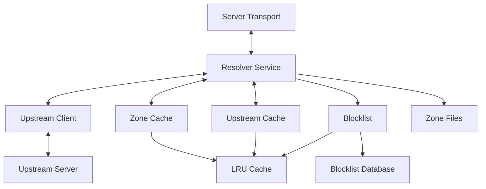

# DNS Resolver Service

This package provides the core DNS resolution service that orchestrates authoritative zones, upstream resolution, caching, and request handling for the RR-DNS server.

## Overview

The `resolver` service acts as the central DNS query processing engine, implementing a hybrid recursive/authoritative DNS resolver with the following capabilities:

- **Authoritative Resolution**: Serves DNS records from locally-managed zone files
- **Upstream Resolution**: Forwards queries to upstream DNS servers when not authoritative
- **Response Caching**: Caches upstream responses with TTL-aware expiration
- **Blocklist Support**: Framework for DNS filtering and security features
- **Transport Abstraction**: Supports multiple DNS protocols (UDP, DoT, DoH, DoQ)

## Architecture

The resolver follows the CLEAN architecture pattern with well-defined interfaces:



## Core Types

### Resolver

The main service that coordinates all DNS resolution activities:

```go
type Resolver struct {
    blocklist     Blocklist
    logger        log.Logger
    transport     ServerTransport
    upstream      UpstreamClient
    upstreamCache Cache
    zoneCache     ZoneCache
}
```

### ResolverOptions

Configuration struct for dependency injection:

```go
type ResolverOptions struct {
    Blocklist     Blocklist
    Logger        log.Logger
    Transport     ServerTransport
    Upstream      UpstreamClient
    UpstreamCache Cache
    ZoneCache     ZoneCache
}
```

## Interfaces

### Core Resolution Interfaces

#### `DNSResponder`
Handles DNS query processing and response generation:
```go
type DNSResponder interface {
    HandleRequest(ctx context.Context, query domain.DNSQuery, clientAddr net.Addr) domain.DNSResponse
}
```

#### `UpstreamClient`
Provides upstream DNS resolution capabilities:
```go
type UpstreamClient interface {
    Resolve(ctx context.Context, query domain.DNSQuery, now time.Time) (domain.DNSResponse, error)
}
```

### Storage Interfaces

#### `ZoneCache`
Manages authoritative DNS records with value-based storage:
```go
type ZoneCache interface {
    FindRecords(query domain.DNSQuery) ([]domain.ResourceRecord, bool)
    PutZone(zoneRoot string, records []domain.ResourceRecord)
    RemoveZone(zoneRoot string)
    Zones() []string
    Count() int
}
```

#### `Cache`
Handles upstream response caching with TTL awareness:
```go
type Cache interface {
    Set(record []domain.ResourceRecord) error
    Get(key string) ([]domain.ResourceRecord, bool)
    Delete(key string)
    Len() int
    Keys() []string
}
```

### Transport and Security Interfaces

#### `ServerTransport`
Abstracts DNS protocol implementations:
```go
type ServerTransport interface {
    Start(ctx context.Context, handler DNSResponder) error
    Stop() error
    Address() string
}
```

#### `Blocklist`
Provides DNS filtering capabilities:
```go
type Blocklist interface {
    IsBlocked(q domain.DNSQuery) bool
}
```

## Usage

### Basic Resolver Setup

```go
package main

import (
    "context"
    "github.com/haukened/rr-dns/internal/dns/services/resolver"
    "github.com/haukened/rr-dns/internal/dns/common/log"
)

func main() {
    // Configure logging
    log.Configure("prod", "info")
    
    // Create resolver with dependencies
    resolver := resolver.NewResolver(resolver.ResolverOptions{
        Blocklist:     myBlocklist,
        Logger:        log.GetLogger(),
        Transport:     udpTransport,
        Upstream:      upstreamClient,
        UpstreamCache: responseCache,
        ZoneCache:     authorityCache,
    })
    
    // Start serving DNS requests
    ctx := context.Background()
    err := resolver.Start(ctx)
    if err != nil {
        log.Fatal(map[string]any{"error": err}, "Failed to start resolver")
    }
}
```

## Resolution Flow

The resolver processes DNS queries through the following decision tree:

1. **Authoritative Lookup**: Check if we have authoritative data for the zone
2. **Blocklist Check**: Query passes through security filtering
3. **Cache Lookup**: Check upstream response cache for recent answers
4. **Upstream Resolution**: Forward query to configured upstream servers
5. **Response Caching**: Cache successful upstream responses
6. **Response Assembly**: Return final DNS response to client

## Features

### Authoritative Resolution
- Serves records from locally-managed zone files
- Supports all standard DNS record types
- Automatic SOA record generation (future)
- DNSSEC-ready architecture

### Recursive Resolution
- Configurable upstream DNS servers
- Intelligent cache management with TTL respect
- Concurrent upstream query support
- Graceful fallback handling

### Performance Optimizations
- Value-based record storage for CPU cache efficiency
- Sub-microsecond cache operations
- Minimal memory allocations in query path
- Concurrent-safe operations

### Security Features
- Extensible blocklist framework
- Client address tracking (v1.0?)
- Query rate limiting support (future)
- DNS over HTTPS/TLS/QUIC transport support (v1.2?)

## Configuration

### Upstream Servers
```go
upstreamClient := &client.DNSClient{
    Servers: []string{
        "1.1.1.1:53",
        "1.0.0.1:53",
        "8.8.8.8:53",
    },
    Timeout: 5 * time.Second,
}
```

### Cache Configuration
```go
upstreamCache, _ := dnscache.New(10000) // 10k cache entries
```

### Zone Management
```go
zoneCache := zonecache.New()
records, _ := zone.LoadZoneFile("example.com.yaml")
zoneCache.PutZone("example.com.", records)
```

## Integration Points

### Transport Layer
The resolver integrates with various transport implementations:
- **UDP**: Standard DNS over UDP (port 53) (MVP)
- **DoT**: DNS over TLS (port 853) (Future)
- **DoH**: DNS over HTTPS (port 443) (Future)
- **DoQ**: DNS over QUIC (experimental) (Future)

### Storage Layer
Interfaces with multiple storage backends:
- **Zone Files**: YAML/JSON/TOML format support
- **Memory Cache**: High-performance LRU caching
- **Future**: Database backends, distributed caches

### Logging Integration
Comprehensive structured logging for:
- Query performance metrics
- Cache hit/miss ratios
- Upstream server health
- Security event tracking

## Testing

The resolver service is designed for comprehensive testing:

```go
func TestResolver(t *testing.T) {
    // Create test dependencies
    mockBlocklist := &testBlocklist{}
    mockTransport := &testTransport{}
    mockUpstream := &testUpstream{}
    testCache := &testCache{}
    testZones := &testZoneCache{}
    
    // Create resolver with test doubles
    resolver := resolver.NewResolver(resolver.ResolverOptions{
        Blocklist:     mockBlocklist,
        Logger:        &log.NoopLogger{},
        Transport:     mockTransport,
        Upstream:      mockUpstream,
        UpstreamCache: testCache,
        ZoneCache:     testZones,
    })
    
    // Test query resolution
    query := domain.DNSQuery{Name: "test.example.com.", Type: domain.A}
    response := resolver.HandleRequest(context.Background(), query, nil)
    
    // Verify response
    assert.Equal(t, domain.NOERROR, response.ResponseCode)
}
```

## Performance Characteristics

- **Authoritative Queries**: Sub-microsecond response times
- **Cached Queries**: ~100 nanosecond cache lookups
- **Upstream Queries**: Network latency + ~500μs processing
- **Memory Usage**: O(n) where n = total cached records
- **Concurrency**: Fully thread-safe, scales with CPU cores

## Dependencies

- `context` - Request lifecycle management
- `net` - Network address handling
- `time` - TTL and timeout management
- `github.com/haukened/rr-dns/internal/dns/domain` - Core DNS domain types
- `github.com/haukened/rr-dns/internal/dns/common/log` - Structured logging

## Future Roadmap

### Planned Features
- Enhanced blocklist capabilities with regex and domain categories
- DNSSEC validation and signing
- Metrics and Prometheus integration
- Geographic DNS routing
- Load balancing across upstream servers

### Performance Improvements
- Memory pool optimization
- Zero-allocation query paths
- Adaptive cache sizing
- Query prioritization

This resolver service forms the core of the RR-DNS system, providing a foundation for high-performance, secure, and extensible DNS resolution.