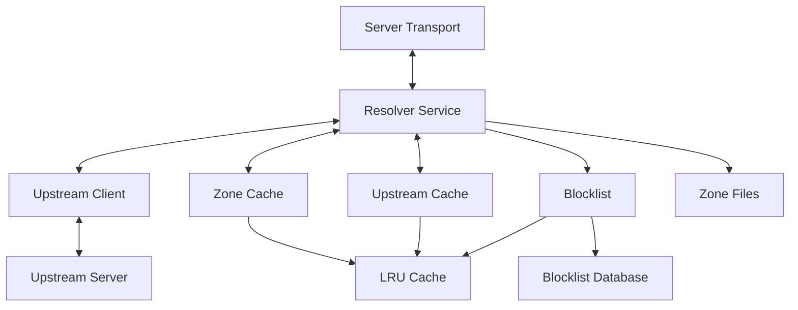

# DNS Resolver Service

This package provides the core DNS resolution service that orchestrates authoritative zones, upstream resolution, caching, and request handling for the RR-DNS server.

## Overview

The `resolver` service acts as the central DNS query processing engine, implementing a hybrid recursive/authoritative DNS resolver with the following capabilities:

- **Authoritative Resolution**: Serves DNS records from locally-managed zone files
- **Upstream Resolution**: Forwards queries to upstream DNS servers when not authoritative
- **Response Caching**: Caches upstream responses with TTL-aware expiration
- **Blocklist Support**: Framework for DNS filtering and security features
- **Transport Abstraction**: Supports multiple DNS protocols (UDP, DoT, DoH, DoQ)

## Architecture

The resolver follows the CLEAN architecture pattern with well-defined interfaces:



### Transport-Driven Design

The RR-DNS resolver follows a **transport-driven architecture** where:

- **Transport owns the lifecycle**: The transport layer (UDP, DoT, DoH, DoQ) manages server startup, shutdown, and connection handling
- **Resolver focuses on logic**: The resolver service purely handles DNS query resolution without network concerns  
- **Clean separation**: Network protocols are abstracted behind the `ServerTransport` interface

**Startup Pattern:**
```go
// Create a single resolver instance with all dependencies
resolver := resolver.NewResolver(resolver.ResolverOptions{
    ZoneCache:     zoneCache,
    UpstreamCache: upstreamCache,
    Upstream:      upstreamClient,
    Blocklist:     blocklist,
    Clock:         clock.NewRealClock(),
    Logger:        logger,
})

// Inject the same resolver into multiple transports
udpTransport := udp.NewTransport(":53")
dotTransport := dot.NewTransport(":853", tlsConfig)
dohTransport := doh.NewTransport(":443", httpConfig)

// All transports share the same resolver instance
go udpTransport.Start(ctx, resolver)  // UDP on port 53
go dotTransport.Start(ctx, resolver)  // DNS-over-TLS on port 853  
go dohTransport.Start(ctx, resolver)  // DNS-over-HTTPS on port 443

// Each transport calls resolver.HandleQuery() for incoming requests
```

**Shared Resolver Benefits:**
- **Single source of truth**: One resolver with one cache, one configuration
- **Consistent behavior**: Same DNS logic across all protocols
- **Resource efficiency**: Shared caches and upstream connections
- **Simplified state**: No synchronization between resolver instances

**Benefits:**
- Easy to swap protocols (UDP → DoT → DoH) without changing resolver logic
- Transport handles protocol-specific concerns (TLS, HTTP/2, connection pooling)
- Resolver stays focused on DNS business logic
- Clear dependency boundaries for testing
- **Multiple protocols simultaneously**: Same resolver serves UDP, DoT, DoH concurrently
- **Shared state**: All protocols use the same caches and upstream connections

**Zone Loading:**
- Zone files are loaded at startup/bootstrap (not by resolver)
- Loaded zones are injected into `ZoneCache` before resolver starts
- Resolver queries the cache but doesn't perform file I/O

## Core Types

### Resolver

The main service that coordinates all DNS resolution activities:

```go
type Resolver struct {
    blocklist     Blocklist
    clock         clock.Clock
    logger        log.Logger
    upstream      UpstreamClient
    upstreamCache Cache
    zoneCache     ZoneCache
}
```

### ResolverOptions

Configuration struct for dependency injection:

```go
type ResolverOptions struct {
    Blocklist     Blocklist
    Clock         clock.Clock
    Logger        log.Logger
    Upstream      UpstreamClient
    UpstreamCache Cache
    ZoneCache     ZoneCache
}
```

## Interfaces

### Core Resolution Interfaces

#### `DNSResponder`
Handles DNS query processing and response generation:
```go
type DNSResponder interface {
    HandleQuery(ctx context.Context, query domain.Question, clientAddr net.Addr) (domain.DNSResponse, error)
}
```

#### `UpstreamClient`
Provides upstream DNS resolution capabilities:
```go
type UpstreamClient interface {
    // Returns upstream answers (resource records). Service assembles DNSResponse.
    Resolve(ctx context.Context, query domain.Question, now time.Time) ([]domain.ResourceRecord, error)
}
```

### Storage Interfaces

#### `ZoneCache`
Manages authoritative DNS records with value-based storage:
```go
type ZoneCache interface {
    FindRecords(query domain.Question) ([]domain.ResourceRecord, bool)
    PutZone(zoneRoot string, records []domain.ResourceRecord)
    RemoveZone(zoneRoot string)
    Zones() []string
    Count() int
}
```

#### `Cache`
Handles upstream response caching with TTL awareness:
```go
type Cache interface {
    Set(record []domain.ResourceRecord) error
    Get(key string) ([]domain.ResourceRecord, bool)
    Delete(key string)
    Len() int
    Keys() []string
}
```

### Transport and Security Interfaces

#### `ServerTransport`
Abstracts DNS protocol implementations:
```go
type ServerTransport interface {
    Start(ctx context.Context, handler DNSResponder) error
    Stop() error
    Address() string
}
```

#### `Blocklist`
Provides DNS filtering capabilities:
```go
type Blocklist interface {
    IsBlocked(q domain.Question) bool
}
```

## Usage

### Basic Resolver Setup

```go
package main

import (
    "context"
    "github.com/haukened/rr-dns/internal/dns/services/resolver"
    "github.com/haukened/rr-dns/internal/dns/common/log"
    "github.com/haukened/rr-dns/internal/dns/common/clock"
)

func main() {
    // Configure logging
    log.Configure("prod", "info")
    
    // Create resolver with dependencies
    resolver := resolver.NewResolver(resolver.ResolverOptions{
        Blocklist:     myBlocklist,
        Clock:         clock.NewRealClock(),
        Logger:        log.GetLogger(),
        Upstream:      upstreamClient,
        UpstreamCache: responseCache,
        ZoneCache:     authorityCache,
    })
    
    // Create transport and inject resolver
    transport := udp.NewTransport(":53")
    ctx := context.Background()
    err := transport.Start(ctx, resolver)
    if err != nil {
        log.Fatal(map[string]any{"error": err}, "Failed to start transport")
    }
}
```

## Resolution Flow

The resolver processes DNS queries through the following decision tree:

1. **Authoritative Lookup**: Check if we have authoritative data for the zone
2. **Blocklist Check**: Applied only to non-authoritative queries
3. **Cache Lookup**: Check upstream response cache for recent answers
4. **Upstream Resolution**: Forward query to configured upstream servers
5. **Response Caching**: Cache successful upstream responses
6. **Response Assembly**: Return final DNS response to client

## Features

### Authoritative Resolution
- Serves records from locally-managed zone files
- Supports all standard DNS record types
- Automatic SOA record generation (future)
- DNSSEC-ready architecture

### Recursive Resolution
- Configurable upstream DNS servers
- Intelligent cache management with TTL respect
- Concurrent upstream query support
- Graceful fallback handling

### Performance Optimizations
- Value-based record storage for CPU cache efficiency
- Sub-microsecond cache operations
- Minimal memory allocations in query path
- Concurrent-safe operations

### Security Features
- Extensible blocklist framework
- Client address tracking (v1.0?)
- Query rate limiting support (future)
- DNS over HTTPS/TLS/QUIC transport support (v1.2?)

## Configuration

### Upstream Servers
```go
// Upstream resolver from gateways/upstream
upstreamClient, _ := upstream.NewResolver(upstream.Options{
    Servers:  []string{"1.1.1.1:53", "1.0.0.1:53", "8.8.8.8:53"},
    Timeout:  5 * time.Second,
    Parallel: true,
    Codec:    wire.NewUDPCodec(log.GetLogger()),
})
```

### Cache Configuration
```go
upstreamCache, _ := dnscache.New(10000) // 10k cache entries
```

### Zone Management
```go
zoneCache := zonecache.New()
records, _ := zone.LoadZoneFile("example.com.yaml")
zoneCache.PutZone("example.com.", records)
```

## Integration Points

### Transport Layer
The resolver integrates with various transport implementations:
- **UDP**: Standard DNS over UDP (port 53) (MVP)
- **DoT**: DNS over TLS (port 853) (Future)
- **DoH**: DNS over HTTPS (port 443) (Future)
- **DoQ**: DNS over QUIC (experimental) (Future)

### Storage Layer
Interfaces with multiple storage backends:
- **Zone Files**: YAML/JSON/TOML format support
- **Memory Cache**: High-performance LRU caching
- **Future**: Database backends, distributed caches

### Logging Integration
Comprehensive structured logging for:
- Query performance metrics
- Cache hit/miss ratios
- Upstream server health
- Security event tracking

## Testing

The resolver service is designed for comprehensive testing:

```go
func TestResolver(t *testing.T) {
    // Create test dependencies
    mockBlocklist := &testBlocklist{}
    mockTransport := &testTransport{}
    mockUpstream := &testUpstream{}
    testCache := &testCache{}
    testZones := &testZoneCache{}
    
    // Create resolver with test doubles
    resolver := resolver.NewResolver(resolver.ResolverOptions{
        Blocklist:     mockBlocklist,
        Clock:         &clock.MockClock{},
        Logger:        &log.NoopLogger{},
        Upstream:      mockUpstream,
        UpstreamCache: testCache,
        ZoneCache:     testZones,
    })
    
    // Test query resolution
    query, _ := domain.NewQuestion(1, "test.example.com.", domain.RRTypeA, domain.RRClassIN)
    response, err := resolver.HandleQuery(context.Background(), query, nil)
    
    // Verify response
    assert.NoError(t, err)
    assert.Equal(t, domain.NOERROR, response.RCode)
}
```

## Performance Characteristics

- **Authoritative Queries**: Lightning-fast response times
- **Cached Queries**: ~100 nanosecond cache lookups
- **Upstream Queries**: Network latency + ~500μs processing
- **Memory Usage**: O(n) where n = total cached records
- **Concurrency**: Fully thread-safe, scales with CPU cores

## Dependencies

- `context` - Request lifecycle management
- `net` - Network address handling
- `time` - TTL and timeout management
- `github.com/haukened/rr-dns/internal/dns/domain` - Core DNS domain types
- `github.com/haukened/rr-dns/internal/dns/common/log` - Structured logging

## Future Roadmap

### Planned Features
- Enhanced blocklist capabilities with regex and domain categories
- DNSSEC validation and signing
- Metrics and Prometheus integration
- Geographic DNS routing
- Load balancing across upstream servers

### Performance Improvements
- Memory pool optimization
- Zero-allocation query paths
- Adaptive cache sizing
- Query prioritization

This resolver service forms the core of the RR-DNS system, providing a foundation for high-performance, secure, and extensible DNS resolution.

## Alias (CNAME) Resolution & Error Policy

The resolver performs CNAME (alias) chain expansion through the injected `AliasResolver`. The policy differentiates between fatal conditions (mapped to `SERVFAIL`) and non-fatal conditions (return partial chain with `NOERROR`).

### Expansion Algorithm (Summary)
1. Start with authoritative answer set. If the first RR is a CNAME and the original query type is not `CNAME`, begin chasing.
2. Append each CNAME hop to the answer chain.
3. For each target:
    - Attempt authoritative lookup for the original RRType.
    - If miss, attempt authoritative lookup for another CNAME (multi-hop support).
    - If still miss, attempt upstream lookup (if configured).
4. Stop when a terminal RRset for the original type is found, no further data exists, or a policy/error condition triggers.
5. Return accumulated chain (CNAME hops plus terminal RRset if found).

### Error Classification
| Condition | Sentinel Error | Fatal? | RCODE | Returned Answers |
|-----------|----------------|--------|-------|------------------|
| Max depth exceeded | `ErrAliasDepthExceeded` | Yes | `SERVFAIL` | None (empty answer section) |
| Loop detected | `ErrAliasLoopDetected` | Yes | `SERVFAIL` | None |
| Target invalid/missing | `ErrAliasTargetInvalid` | No | `NOERROR` | Partial chain (up to failing CNAME) |
| Question build failed (invalid RRType) | `ErrAliasQuestionBuild` | No | `NOERROR` | Partial chain |
| Upstream miss / empty authoritative data | (no error) | No | `NOERROR` | Chain so far (CNAME hops only) |
| Successful terminal resolution | (nil) | No | `NOERROR` | Full chain + terminal RRset |

Fatal errors indicate systemic issues (loop or runaway depth) where continuing could imply misconfiguration or potential resource abuse. They are mapped to `SERVFAIL` to signal resolution failure to the client without leaking partial/internal state.

Non-fatal errors represent localized data defects (bad target, invalid RRType for synthetic question) or mere absence of further data. Returning the partial chain under `NOERROR` allows the client to inspect the CNAME(s) already discovered and potentially re-query directly using another resolver or adjusted parameters.

### Policy Rationale
* Depth / loop issues are resolver-scope failures → `SERVFAIL`.
* Malformed target or follow-up question are zone data issues, not core resolver failure → still return what we have.
* Providing partial chains aids debugging and client fallback logic.
* Policy can be tuned by adjusting `isFatalAliasError` in `resolver.go` (add or remove sentinel errors from fatal list).

### Modifying Policy
To treat additional errors as fatal, update:
```go
func (r *Resolver) isFatalAliasError(err error) bool {
     return errors.Is(err, ErrAliasDepthExceeded) ||
              errors.Is(err, ErrAliasLoopDetected) // extend here
}
```
You can also make this configurable (e.g., via injected config struct) if operational requirements differ across deployments.

### Observability
* Fatal alias errors are logged at `Error` level with structured context (query, error).
* Non-fatal alias errors are logged at `Warn` level when they occur, preserving visibility without causing resolution failure.

This design balances correctness, safety (guarding against pathological chains), and transparency (returning useful partial data where possible).